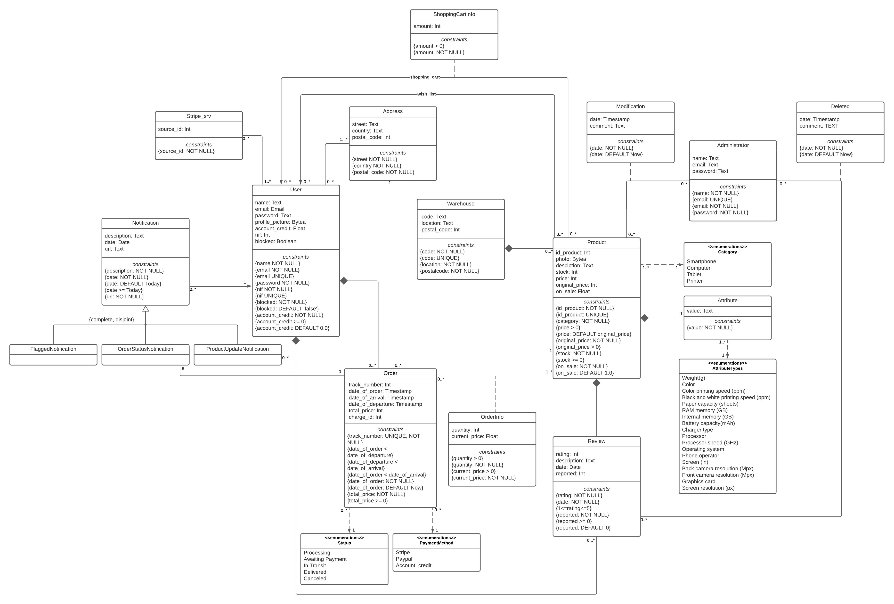

# EBD: Database Specification Component

The Conceptual Data Model contains the identification and description of the entities and relationships that are relevant to the database specification.

## A4: Conceptual Data Model

The UML diagram in Figure 1 presents the main organisational entities, the relationships between them, attributes and their domains, and the multiplicity of relationships for the **FEUP-TECH** platform.

### 1. Class diagram



**Figure 1** - UML Class Diagram

### 2. Additional Business Rules

* BR01. In order, <span dir="">total_price is the sum of the price of all products in the order</span>.
* BR02. <span dir="">After 3 total deleted reviews the author is blocked</span> from making any more.

## A5: Relational Schema, validation and schema refinement

<span dir="">This artifact contains the Relational Schema obtained by mapping from the Conceptual Data Model. The Relational Schema includes each relation schema, attributes, domains, primary keys, foreign keys and other integrity rules: UNIQUE, DEFAULT, NOT NULL, CHECK.</span>

### 1. Relational Schema

<div>

| Relation Reference | Relation Compact Notation |
|--------------------|---------------------------|
| <span dir="">R01</span> | <span dir="">user(**id**, name NN, email NN UK, password NN, nif NN UK, profile_picture, blocked NN DF ‘false’, account_credit NN DF 0.0 CK account_credit  >= 0)</span> |
| <span dir="">R02</span> | <span dir="">administrator(**id**, name NN, password NN, email NN UK)</span> |
| <span dir="">R03</span> | <span dir="">warehouse(**id**, code NN UK, location NN, postal_code NN)</span> |
| <span dir="">R04</span> | <span dir="">product(**id**, id_product NN UK, photo, category NN CK category IN Categories, description, stock NN CK stock >= 0, price CK price > 0 DF original_price, original_price NN CK original_price  > 0, code->warehouse NN, on_sale NN DF 1.0)</span> |
| <span dir="">R05</span> | <span dir="">attribute(**attribute_type** CK attribute_type IN AttributeTypes,  **id_product**->product.id NN, value NN)</span> |
| <span dir="">R06</span> | <span dir="">review(**id**, rating NN CK 1<=rating<=5, description, date NN, id_user->user.id NN, id_product->product.id NN, reported NN CK reported >= 0 DF 0)</span> |
| <span dir="">R07</span> | <span dir="">address(**id**, street NN, country NN, postal_code NN)</span> |
| <span dir="">R08</span> | <span dir="">stripe_srv(**id**, source_id NN)</span> |
| <span dir="">R09</span> | <span dir="">order(**id**, track_number NN UK, date_of_order NN DF Now, date_of_arrival CK date_of_order < date_of_arrival, date_of_departure CK date_of_departure < date_of_arrival and date_of_order < date_of_departure, total_price NN CK total_price >= 0, charge_id, order_status NN CK order_status IN Status, id_user->user.id NN, id_address -> address.id, payment NN CK payment IN PaymentMethod)</span> |
| <span dir="">R10</span> | <span dir="">order_info(**order_info**->order NN, **id_product**->product.id NN, quantity NN CK quantity > 0, current_price NN CK current_price > 0)</span> |
| <span dir="">R11</span> | <span dir="">notification(**id**, description NN, date NN CK date >= Today DF Today, id_user->user.id NN, url NN)</span> |
| <span dir="">R12</span> | <span dir="">flagged_notification(**id_notification** -> notification.id)</span> |
| <span dir="">R13</span> | <span dir="">order_status_notification(**id_notification** -> notification.id, **id_order** -> order.id)</span> |
| <span dir="">R14</span> | <span dir="">product_update_notification(**id_notification** -> notification.id, **id_product**-> product.id)</span> |
| <span dir="">R15</span> | <span dir="">shopping_cart_info(**id_user**->user.id, **id_product**->product.id, amount NN CK amount > 0)</span> |
| <span dir="">R16</span> | <span dir="">wish_list(**id_user**->user.id, **id_product**->product.id)</span> |
| <span dir="">R17</span> | <span dir="">user_address(**id_adress**->address.id, **id_user**->user.id)</span> |
| <span dir="">R18</span> | <span dir="">user_stripe(**id_user**->user.id, **id_stripe**->stripe_srv)</span> |
| <span dir="">R19</span> | <span dir="">modification(**id_product**->product.id, **id_admin**->administrator.id, **date** NN DF Now, comment)</span> |
| <span dir="">R20</span> | <span dir="">deleted(**id_admin**->administrator.id, **id_review**->review.id, **date** NN DF Now, comment)</span> |

We opted to represent our generalization representing all of our classes and linking the subclasses to the super-class together with a foreign key. We decided to go for this approach since all the notifications are expected to include different attributes considering their context and in the website they are all treated similarly regardless of what type of notification they are.

</div>

### 2. Domains

<div>

| Domain Name | Domain Specifications |
|-------------|-----------------------|
| <span dir="">Today </span> | <span dir="">DATE DEFAULT CURRENT_DATE</span> |
| <span dir="">Now</span> | <span dir="">TIMESTAMP DEFAULT CURRENT_TIMESTAMP </span> |
| <span dir="">Status</span> | <span dir="">ENUM (‘Awaiting payment’,‘Processing’, ‘In Transit’, ‘Delivered’, ‘Canceled’)</span> |
| <span dir="">Categories</span> | <span dir="">ENUM (‘Smartphone’, ‘Computer’, ‘Tablet’, ‘Printer’)</span> |
| <span dir="">PaymentMethod</span> | <span dir="">ENUM (‘Stripe’, ‘Paypal’, ‘Account_credit)</span> |
| <span dir="">AttributeTypes</span> | <span dir="">ENUM (‘Weight (g)’, ‘Color’, ‘Color printing speed (ppm)’, ‘Black and white printing speed (ppm)’, ‘Paper capacity’, ‘RAM memory (Gb)’, ‘Internal memory (Gb)’, ‘Battery capacity (mAh)’, ‘Charger type’, ‘Processor’, ‘Processor speed (GHz)’, ‘Operating System’, ‘Phone operator’, ‘Screen (in)’, ‘Back camera resolution (Mpx)’, ‘Front camera resolution (Mpx)’, ‘Graphics card’,‘Screen resolution (px)’)</span> |

</div>

### 3. Schema validation

<div>

| **<span dir="">Table</span>**<span dir=""> **R01**</span> | User |
|-----------------------------------------------------------|------|
| **<span dir="">Keys</span>** | {id}, {email}, {nif} |
| **<span dir="">Functional Dependencies</span>:** |  |
| <span dir="">FD0101</span> | <span dir="">{id} -> {name, email, password, nif, profile_picture, blocked, account_credit}</span> |
| <span dir="">FD0102</span> | <span dir="">{email} -> {id, name, password, nif, profile_picture, blocked, account_credit}</span> |
| <span dir="">FD0103</span> | <span dir="">{nif} -> {id, name, email, password, profile_picture, blocked, account_credit}</span> |
| **NORMAL FORM** | <span dir="">BCNF </span> |

| **<span dir="">Table</span>**<span dir=""> **R02**</span> | Administrator |
|-----------------------------------------------------------|---------------|
| **<span dir="">Keys</span>** | {id}, {email} |
| **<span dir="">Functional Dependencies</span>:** |  |
| <span dir="">FD0201</span> | <span dir="">{id} -> {name, password, email}</span> |
| <span dir="">FD0202</span> | <span dir="">{email} -> {id, password, nome}</span> |
| **NORMAL FORM** | <span dir="">BCNF</span> |

| **<span dir="">Table</span>**<span dir=""> **R03**</span> | Warehouse |
|-----------------------------------------------------------|-----------|
| **<span dir="">Keys</span>** | {id}, {code} |
| **<span dir="">Functional Dependencies</span>:** |  |
| <span dir="">FD0301</span> | <span dir="">{code} -> {location, postal_code, id}</span> |
| FD0302 | {id} -> {code, location,postal_code} |
| **NORMAL FORM** | <span dir="">BCNF</span> |

| **<span dir="">Table</span>**<span dir=""> **R04**</span> | Product |
|-----------------------------------------------------------|---------|
| **<span dir="">Keys</span>**<span dir="">: {id}</span> | {id}, {id_product} |
| **<span dir="">Functional Dependencies</span>:** |  |
| <span dir="">FD0401</span> | <span dir="">{id} -> {id_product, photo, description, stock, category, price, orginal_price, code->warehouse, on_sale}</span> |
| <span dir="">FD0402</span> | <span dir="">{id_product} -> {id, photo, description, stock, category, price, orginal_price, code->warehouse, on_sale}</span> |
| **NORMAL FROM** | <span dir="">BCNF</span> |

| **<span dir="">Table</span>**<span dir=""> **R05**</span> | Attribute |
|-----------------------------------------------------------|-----------|
| **<span dir="">Keys</span>** | {id_product,atribute_type} |
| **<span dir="">Functional Dependencies</span>:** |  |
| <span dir="">FD0501</span> | <span dir="">{id_product, type} -> {value}</span> |
| **NORMAL FORM** | <span dir="">BCNF</span> |

| **<span dir="">Table</span>**<span dir=""> **R06**</span> | Review |
|-----------------------------------------------------------|--------|
| **<span dir="">Keys</span>** | {id}, {id_user, id_product} |
| **<span dir="">Functional Dependencies</span>:** |  |
| <span dir="">FD0601</span> | <span dir="">{id} -> {rating, description, date, id_user, id_product, reported}</span> |
| <span dir="">FD0602</span> | <span dir="">{id_product, id_user} -> {id, rating, description, date, reported}</span> |
| **NORMAL FORM** | <span dir="">BCNF</span> |

| **<span dir="">Table</span>**<span dir=""> **R07**</span> | Address |
|-----------------------------------------------------------|---------|
| **<span dir="">Keys</span>** | {id} |
| **<span dir="">Functional Dependencies</span>:** |  |
| <span dir="">FD0701</span> | <span dir="">{id} -> {street, country, postal_code}</span> |
| **NORMAL FORM** | <span dir="">BCNF</span> |

| **<span dir="">Table</span>**<span dir=""> **R08**</span> | Stripe_srv |
|-----------------------------------------------------------|------------|
| **<span dir="">Keys</span>** | {id} |
| **<span dir="">Functional Dependencies</span>:** |  |
| <span dir="">FD0801</span> | <span dir="">{id-> source_id}</span> |
| **NORMAL FORM** | <span dir="">BCNF</span> |

| **<span dir="">Table</span>**<span dir=""> **R09**</span> | Order |
|-----------------------------------------------------------|-------|
| **<span dir="">Keys</span>**<span dir="">: </span> | {track_number}, {id} |
| **<span dir="">Functional Dependencies</span>:** |  |
| <span dir="">FD0901</span> | <span dir="">{track_number} -> {date_of_order, date_of_arrival, date_of_departure, total_price, charge_id, order_status, id_user, id_adress, payment, id}</span> |
| FD092 | {id} -> {date_of_order, date_of_arrival, date_of_departure, total_price, charge_id, order_status, id_user, id_adress, payment, track_number} |
| **NORMAL FORM** | <span dir="">BCNF</span> |

| **<span dir="">Table</span>**<span dir=""> **R10**</span> | Order_info |
|-----------------------------------------------------------|------------|
| **<span dir="">Keys</span>**<span dir="">:</span> | {order_id, id_product} |
| **<span dir="">Functional Dependencies</span>** |  |
| <span dir="">FD1001</span> | <span dir="">{</span>order_id<span dir="">, id_product} -> {quantity, current_price}</span> |
| **NORMAL FORM** | <span dir="">BCNF</span> |

| **<span dir="">Table</span>**<span dir=""> **R11**</span> | Notification |
|-----------------------------------------------------------|--------------|
| **<span dir="">Keys</span>** | {id} |
| **<span dir="">Functional Dependencies</span>:** |  |
| <span dir="">FD1101</span> | <span dir="">{id} -> {description, date, url, id_user}</span> |
| **<span dir="">N</span>ORMAL FORM** | <span dir="">BCNF</span> |

| **<span dir="">Table</span>**<span dir=""> **R12**</span> | Flagged_notification |
|-----------------------------------------------------------|----------------------|
| **<span dir="">Keys</span>** | {id_notification} |
| **<span dir="">Functional Dependencies</span>:** |  |
| **NORMAL FORM** | <span dir="">BCNF</span> |

| **<span dir="">Table</span>**<span dir=""> **R13**</span> | Order_status_notification |
|-----------------------------------------------------------|---------------------------|
| **<span dir="">Keys</span>** | {id_notification, id_order} |
| **<span dir="">Functional Dependencies</span>:** |  |
| **NORMAL FORM** | <span dir="">BCNF</span> |

| **<span dir="">Table</span>**<span dir=""> **R14**</span> | Product_update_notification |
|-----------------------------------------------------------|-----------------------------|
| **<span dir="">Keys</span>** | {id_notification, id_product} |
| **<span dir="">Functional Dependencies</span>:** |  |
| **NORMAL FORM** | <span dir="">BCNF</span> |

| **<span dir="">Table</span>**<span dir=""> **R15**</span> | Shopping_cart_info |
|-----------------------------------------------------------|--------------------|
| **<span dir="">Keys</span>** | {id_user, id_product} |
| **<span dir="">Functional Dependencies</span>:** |  |
| <span dir="">FD1501</span> | <span dir="">{id_user, id_product} -> {amount}</span> |
| **NORMAL FORM** | <span dir="">BCNF</span> |

| **<span dir="">Table</span>**<span dir=""> **R16**</span> | Wish_list |
|-----------------------------------------------------------|-----------|
| **<span dir="">Keys</span>** | {id_user, id_product} |
| **<span dir="">Functional Dependencies</span>:** |  |
| **<span dir="">N</span>ORMAL FORM** | <span dir="">BCNF</span> |

| **<span dir="">Table</span>**<span dir=""> **R17**</span> | User_address |
|-----------------------------------------------------------|--------------|
| **<span dir="">Keys</span>**<span dir="">:</span> | {id_address, id_user} |
| **<span dir="">Functional Dependencies</span>** |  |
| **NORMAL FORM** | <span dir="">BCNF</span> |

| **<span dir="">Table</span>**<span dir=""> **R18**</span> | User_stripe |
|-----------------------------------------------------------|-------------|
| **<span dir="">Keys</span>** | {id_user, id_stripe} |
| **<span dir="">Functional Dependencies</span>:** |  |
| **NORMAL FORM** | <span dir="">BCNF</span> |

| **<span dir="">Table</span>**<span dir=""> **R19**</span> | Modification |
|-----------------------------------------------------------|--------------|
| **<span dir="">Keys</span>** | {id_product, id_admin, date} |
| **<span dir="">Functional Dependencies</span>** |  |
| <span dir="">FD1901</span> | <span dir="">{id_product, id_admin, date} -> {comment}</span> |
| **NORMAL FORM** | <span dir="">BCNF</span> |

| **<span dir="">Table</span>**<span dir=""> **R20**</span> | Deleted |
|-----------------------------------------------------------|---------|
| **<span dir="">Keys</span>** | {id_admin, id_review, date} |
| **<span dir="">Functional Dependencies</span>:** |  |
| <span dir="">FD2001</span> | <span dir="">{id_admin, id_review, date} -> {comment}</span> |
| **NORMAL FORM** | <span dir="">BCNF</span> |

Since all relations are in the Boyce–Codd Normal Form (BCNF) the whole schema is also in BCNF which means that we don't need to normalize it any more than it already is.

</div>

## A6: Indexes, triggers, transactions and database population

<span dir="">This artefact contains the physical schema of the database, the identification and characterisation of the indexes, the support of data integrity rules with triggers and the definition of the database user-defined functions.</span>

<span dir="">Furthermore, it also shows the database transactions needed to assure the integrity of the data in the presence of concurrent accesses. For each transaction, the isolation level is explicitly stated and justified.</span>

<span dir="">This artefact also contains the database's workload as well as the complete database creation script, including all SQL necessary to define all integrity constraints, indexes and triggers. Finally, this artefact also includes a separate script with INSERT statements to populate the database.</span>

### 1. Database Workload

| **<span dir="">Relation</span>** | **<span dir="">Relation name</span>** | **<span dir="">Order magnitude</span>** | **<span dir="">Estimated growth</span>** |
|----------------------------------|---------------------------------------|-----------------------------------------|------------------------------------------|
| <span dir="">R01</span> | <span dir="">user</span> | <span dir="">10 k</span> | <span dir="">10 / day</span> |
| <span dir="">R02</span> | <span dir="">administrator</span> | <span dir="">100</span> | <span dir="">1 / month</span> |
| <span dir="">R03</span> | <span dir="">warehouse</span> | <span dir="">10</span> | <span dir="">1 / month</span> |
| <span dir="">R04</span> | <span dir="">product</span> | <span dir="">1 k</span> | <span dir="">1 / day</span> |
| <span dir="">R05</span> | <span dir="">attribute</span> | <span dir="">1 k</span> | <span dir="">1 / day</span> |
| <span dir="">R06</span> | <span dir="">review</span> | <span dir="">1 k</span> | <span dir="">1 / day</span> |
| <span dir="">R07</span> | <span dir="">address</span> | <span dir="">10 k</span> | <span dir="">10 / day</span> |
| <span dir="">R08</span> | <span dir="">stripe_srv</span> | <span dir="">10 k</span> | <span dir="">10 / day</span> |
| <span dir="">R09</span> | <span dir="">order</span> | <span dir="">10 k</span> | <span dir="">10 / day</span> |
| <span dir="">R10</span> | <span dir="">order_info</span> | <span dir="">10 k</span> | <span dir="">10 / day</span> |
| <span dir="">R11</span> | <span dir="">notification</span> | <span dir="">100 k</span> | <span dir="">100 / day</span> |
| <span dir="">R12</span> | <span dir="">flagged_notification</span> | <span dir="">100</span> | <span dir="">1 / day</span> |
| <span dir="">R13</span> | <span dir="">order_status_notification</span> | <span dir="">100 k</span> | <span dir="">100 / day</span> |
| <span dir="">R14</span> | <span dir="">product_update_notification</span> | <span dir="">100</span> | <span dir="">1 / day</span> |
| <span dir="">R15</span> | <span dir="">shopping_cart_info</span> | <span dir="">10 k</span> | <span dir="">10 / day</span> |
| <span dir="">R16</span> | <span dir="">wish_list</span> | <span dir="">10 k</span> | <span dir="">10 / day</span> |
| <span dir="">R17</span> | <span dir="">user_address</span> | <span dir="">10 k</span> | <span dir="">10 / day</span> |
| <span dir="">R18</span> | <span dir="">user_stripe</span> | <span dir="">10 k</span> | <span dir="">10 / day</span> |
| <span dir="">R19</span> | <span dir="">modification</span> | <span dir="">10 k</span> | <span dir="">10 / day</span> |
| <span dir="">R20</span> | <span dir="">deleted</span> | <span dir="">1 k</span> | <span dir="">1 / month</span> |

### 2. Proposed Indices

#### 2.1 Performance Indices

<div>

| Index | <span dir="">IDX0</span>1 |
|-------|---------------------------|
| <span dir="">Index relation</span> | <span dir="">product</span> |
| <span dir="">Index attribute</span> | <span dir="">category</span> |
| <span dir="">Index type</span> | <span dir="">B-tree</span> |
| <span dir="">Cardinality</span> | <span dir="">Low</span> |
| <span dir="">Clustering</span> | <span dir="">Yes</span> |
| <span dir="">Justification</span> | <span dir="">Table _product_ will contain a large number of rows. Since users will search products by category frequently, sorting them by this attribute is an important feature that should be as quick as possible. A Btree was chosen, because an exact match is not possible considering that various products have the same category and it provides a good sorting and searching performance. Clustering was used, since we considered that the table products is modified sparsely enough for it to be beneficial.</span> |

```sql
CREATE INDEX category_product_index ON lbaw2124.product USING btree (category);
CLUSTER lbaw2124.product USING category_product_index;
```
| Index | <span dir="">IDX0</span>2 |
|-------|---------------------------|
| <span dir="">Index relation</span> | <span dir="">review</span> |
| <span dir="">Index attribute</span> | <span dir="">rating</span> |
| <span dir="">Index type</span> | <span dir="">B-tree</span> |
| <span dir="">Cardinality</span> | <span dir="">Low</span> |
| <span dir="">Clustering</span> | <span dir="">Yes</span> |
| <span dir="">Justification</span> | <span dir="">Table _review_ will contain a large number of rows. Since users will search reviews by rating frequently, sorting them by this attribute is an important feature that should be as quick as possible. A Btree was chosen, because an exact match is not possible considering that various products have the same category and it provides a good sorting and searching performance. Clustering was used, since we considered that the table review is modified sparsely enough for it to be beneficial.</span> |

```sql
CREATE INDEX rating_review_index ON lbaw2124.review USING btree (rating);
CLUSTER lbaw2124.review USING rating_review_index;
```
| Index | <span dir="">IDX0</span>3 |
|-------|---------------------------|
| <span dir="">Index relation</span> | <span dir="">order</span> |
| <span dir="">Index attribute</span> | <span dir="">id_user</span> |
| <span dir="">Index type</span> | <span dir="">Hash</span> |
| <span dir="">Cardinality</span> | <span dir="">Low</span> |
| <span dir="">Clustering</span> | <span dir="">No</span> |
| <span dir="">Justification</span> | <span dir="">Table _order_ will contain a large number of rows. Since id_user is commonly searched by administrators when looking for a users’ orders, matching an order with its user is an important feature that should be as quick as possible. A Hash index was chosen, because we are looking for an exact match on a column with unique data and it provides a good matching and searching performance. Clustering is unnecessary since the attribute is unique.</span> |

```sql
CREATE INDEX id_user_index ON lbaw2124.order USING hash (id_user);
```

</div>
<div>

| Index | <span dir="">IDX0</span>4 |
|-------|---------------------------|
| <span dir="">Index relation</span> | <span dir="">orders</span> |
| <span dir="">Index attribute</span> | <span dir="">order_status</span> |
| <span dir="">Index type</span> | <span dir="">B-tree</span> |
| <span dir="">Cardinality</span> | <span dir="">Low</span> |
| <span dir="">Clustering</span> | <span dir="">No</span> |
| <span dir="">Justification</span> | <span dir="">Table _order_ will contain a large number of rows. Since the store administrators are the ones manually updating the order status, each time a relevant event occurs, displaying them by status is an important feature that allows for a better dashboard organization and usability. A Btree was chosen, because an exact match is not the case (the order status is an enum structure) and it provides a good sorting and searching performance. Clustering was considered, but this attribute has one of the largest modification rates, so constantly making this operation would be a setback.</span> |

```sql
CREATE INDEX order_status_index ON lbaw21224.orders USING btree (order_status);
```

</div>
<div>

| Index | <span dir="">IDX0</span>5 |
|-------|---------------------------|
| <span dir="">Index relation</span> | <span dir="">notifications</span> |
| <span dir="">Index attribute</span> | <span dir="">id_user</span> |
| <span dir="">Index type</span> | <span dir="">B-tree</span> |
| <span dir="">Cardinality</span> | <span dir="">Low</span> |
| <span dir="">Clustering</span> | <span dir="">No</span> |
| <span dir="">Justification</span> | <span dir="">Table _notifications_ will contain a large number of rows. Since a user looking up their notifications is a common event, sorting the notifications by user is an important feature that should be as quick as possible. A Btree was chosen, because the data of the column is not unique to use hash indexes, and it provides a good sorting and searching performance. Clustering was considered, but notifications are created very frequently and we consider that constantly clustering the table after each INSERT would be a setback.</span> |

```sql
CREATE INDEX notif_user_index ON lbaw21224.notification USING btree (id_user);
```

</div>

#### 2.2 Full-text Search Indices

| Index | IDX11 |
|-------|-------|
| Index relation | <span dir="">product</span> |
| Index attributes | <span dir="">category, description</span> |
| Index type | <span dir="">GIST</span> |
| Clustering | <span dir="">No</span> |
| Justification | <span dir="">Since technology products are the key aspect of the store, this index provides a fast lookup of products, according to their characteristics and description. GIST type was selected, because we expect a high volume of insertions in this table, considering it dynamic and therefore preferring the slower lookup time for the </span> |

```sql
ALTER TABLE product
ADD COLUMN tsvectors TSVECTOR;

CREATE FUNCTION product_search_update() RETURNS TRIGGER AS $$
BEGIN
 IF TG_OP = 'INSERT' THEN
        NEW.tsvectors = (
         setweight(to_tsvector('english', NEW.category::Text), 'A') ||
         setweight(to_tsvector('english', NEW.description), 'B')
        );
 END IF;
 IF TG_OP = 'UPDATE' THEN
         IF (NEW.description <> OLD.description OR NEW.category <> OLD.category) THEN
           NEW.tsvectors = (
             setweight(to_tsvector('english',  NEW.category::Text), 'A') ||
               setweight(to_tsvector('english', NEW.description), 'B')
           );
         END IF;
 END IF;
 RETURN NEW;
END $$
LANGUAGE plpgsql;

CREATE TRIGGER product_update
 BEFORE INSERT OR UPDATE ON product
 FOR EACH ROW
 EXECUTE PROCEDURE product_search_update();


CREATE INDEX search_idx ON product USING gist (tsvectors);
```
| Index | IDX12 |
|-------|-------|
| Index relation | <span dir="">attribute</span> |
| Index attributes | <span dir="">attribute_type, value</span> |
| Index type | <span dir="">GIST</span> |
| Clustering | <span dir="">No</span> |
| Justification | <span dir="">The products’ attributes are used for search filtering, as users often search products for their specifications and characteristics. Since many attributes repeat, in our fixed product categories, they can be used to more easily filter search inputs and provide the user with faster response times. Different products have different attribute_types (printers have printer speed, smartphones have RAM) so this attribute has priority over its value. We also expect this table to have frequent insertions (each time a product is added) so GIST type was used.</span> |

```sql
ALTER TABLE attribute
ADD COLUMN tsvectors TSVECTOR;

CREATE FUNCTION attribute_search_update() RETURNS TRIGGER AS $$
BEGIN
IF TG_OP = 'INSERT' THEN
       NEW.tsvectors = (
        setweight(to_tsvector('english', NEW.attribute_type::text), 'A') ||
        setweight(to_tsvector('english', NEW.value), 'B')
       );
END IF;
IF TG_OP = 'UPDATE' THEN
        IF (NEW.attribute_type <> OLD.attribute_type OR NEW.value <> OLD.value) THEN
          NEW.tsvectors = (
            setweight(to_tsvector('english', NEW.attribute_type::text), 'A') ||
            setweight(to_tsvector('english', NEW.value), 'B')
          );
        END IF;
END IF;
RETURN NEW;
END $$
LANGUAGE plpgsql;


CREATE TRIGGER attribute_search_update
BEFORE INSERT OR UPDATE ON attribute
FOR EACH ROW
EXECUTE PROCEDURE attribute_search_update();

CREATE INDEX search_attribute_idx ON attribute USING gist (tsvectors);
```

### 3. Triggers

| Trigger | TRIGGER01 |
|---------|-----------|
| **<span dir="">Description</span>** | <span dir="">When a user has had three reviews removed by an admin, the user’s block attribute has to be set to true, to indicate the user is blocked from making any more reviews. </span> |

```sql
CREATE FUNCTION block_user() RETURNS TRIGGER AS $check_block$
begin
    IF (SELECT COUNT (*) FROM (SELECT * FROM lbaw2124.deleted, lbaw2124.review WHERE review.id = deleted.id_review AND review.id_user = (SELECT id_user FROM lbaw2124.review WHERE review.id = NEW.id_review)) AS ta) >= 3 THEN
        UPDATE lbaw2124.users
        SET blocked = true
        WHERE users.id = (SELECT id_user FROM lbaw2124.review WHERE review.id = NEW.id_review);
    END IF;
    RETURN old;
end
$check_block$
    LANGUAGE plpgsql;

CREATE
   TRIGGER check_block
   AFTER
       INSERT
   ON lbaw2124.deleted
   FOR EACH ROW
EXECUTE PROCEDURE block_user();
```

<div>

| Trigger | TRIGGER02 |
|---------|-----------|
| **<span dir="">Description</span>** | <span dir="">When a new user is inserted into the users' table it verifies if its nif is valid, if not, the user is not added to the table and an exception is raised. </span> |

```sql
CREATE FUNCTION alert_wrong_nif() RETURNS TRIGGER AS $invalid_nif$
DECLARE
nif_s TEXT := CAST (NEW.NIF AS int8);
control_1 INTEGER;
control_2 INTEGER;
control_3 INTEGER;
control_4 INTEGER;
control_5 INTEGER;
control_6 INTEGER;
control_7 INTEGER;
control_8 INTEGER;
control_9 INTEGER;
control_cal INTEGER;
control_div INTEGER;
control_mod INTEGER;
begin
	IF ((NEW.nif > 999999999 ) OR (NEW.nif < 100000000)) THEN
    	RAISE NOTICE 'O nif é Invalido';
	ELSE
    	control_1 := 9 * CAST(SUBSTRING (nif_s,1,1) AS INTEGER);
    	control_2 := 8 * CAST(SUBSTRING (nif_s,2,1) AS INTEGER);
    	control_3 := 7 * CAST(SUBSTRING (nif_s,3,1) AS INTEGER);
    	control_4 := 6 * CAST(SUBSTRING (nif_s,4,1) AS INTEGER);
    	control_5 := 5 * CAST(SUBSTRING (nif_s,5,1) AS INTEGER);
    	control_6 := 4 * CAST(SUBSTRING (nif_s,6,1) AS INTEGER);
 	    control_7 := 3 * CAST(SUBSTRING (nif_s,7,1) AS INTEGER);
    	control_8 := 2 * CAST(SUBSTRING (nif_s,8,1) AS INTEGER);
    	control_9 := 1 * CAST(SUBSTRING (nif_s,9,1) AS INTEGER);
    	control_cal := control_1 +  control_2 + control_3 + control_4 + control_5 + control_6 + control_7 + control_8;
    	control_div := control_cal/11;
    	control_mod := control_cal - control_div * 11;
    	IF (control_mod < 2 AND control_9 != 0) OR (control_mod >= 2 AND control_9 != (11 - control_mod)) THEN
        	RAISE NOTICE 'O nif é Invalido';
    	ELSE
        	RETURN NEW;
    	END IF;
	END IF;
	RETURN NULL;
end
$invalid_nif$ LANGUAGE plpgsql;

CREATE
   TRIGGER invalid_nif
   BEFORE
   	INSERT
   ON lbaw2124.users
   FOR EACH ROW
  	EXECUTE PROCEDURE alert_wrong_nif();
```
| Trigger | TRIGGER03 |
|---------|-----------|
| **<span dir="">Description</span>** | <span dir="">When a product does not have an assigned price, it has to be set to its original price.</span> |

```sql
CREATE FUNCTION assign_price() RETURNS TRIGGER AS $check_price$
begin
    IF (NEW.price IS NULL) THEN
        UPDATE lbaw2124.product
        SET price = NEW.original_price
        WHERE product.id = NEW.id;
    END IF;
    RETURN old;
end
$check_price$
    LANGUAGE plpgsql;

CREATE
    TRIGGER check_price
    AFTER
        INSERT
    ON lbaw2124.product
    FOR EACH ROW
        EXECUTE PROCEDURE assign_price();
```
| Trigger | TRIGGER04 |
|---------|-----------|
| **<span dir="">Description</span>** | <span dir="">When an address is added by a user this function verifies if the postal code is valid</span>. |

```sql
CREATE FUNCTION alert_wrong_postal_code() RETURNS TRIGGER AS $invalid_postal_code$
DECLARE
begin
	IF ((NEW.postal_code > 9999999 ) OR (NEW.postal_code < 1000000)) THEN
    	RAISE NOTICE 'O código postal é Invalido';
    ELSE
    	RETURN NEW;
	END IF;
	RETURN NULL;
end
$invalid_postal_code$ LANGUAGE plpgsql;

CREATE
   TRIGGER invalid_postal_code
   BEFORE
   	INSERT
   ON lbaw2124.address
   FOR EACH ROW
  	EXECUTE PROCEDURE alert_wrong_postal_code();
```
| Trigger | TRIGGER05 |
|---------|-----------|
| **<span dir="">Description</span>** | <span dir="">When a warehouse  is added  this function verifies if the postal code is valid</span>. |

```sql
CREATE FUNCTION alert_wrong_postal_code() RETURNS TRIGGER AS $invalid_postal_code$
DECLARE
begin
	IF ((NEW.postal_code > 9999999 ) OR (NEW.postal_code < 1000000)) THEN
    	RAISE NOTICE 'O código postal é Invalido';
    ELSE
    	RETURN NEW;
	END IF;
	RETURN NULL;
end
$invalid_postal_code$ LANGUAGE plpgsql;

CREATE
   TRIGGER invalid_postal_code_warehouse
   BEFORE
   	INSERT
   ON lbaw2124.warehouse
   FOR EACH ROW
  	EXECUTE PROCEDURE alert_wrong_postal_code();
```
| Trigger | TRIGGER06 |
|---------|-----------|
| **<span dir="">Description</span>** | <span dir="">When a warehouse is removed, although it's foreign key in the product table is modified to null, the stock attribute has to be set to 0, to indicate the product is no longer in stock. </span> |

```sql
CREATE FUNCTION update_stock() RETURNS TRIGGER AS
$$
begin
   UPDATE product
   SET stock = 0, on_sale = false
   WHERE product.code IS NULL;
   RETURN NULL;
end
$$ LANGUAGE plpgsql;

CREATE
   TRIGGER product_stock
   AFTER DELETE ON warehouse
   FOR EACH ROW
EXECUTE PROCEDURE update_stock();
```
| Trigger | TRIGGER07 |
|---------|-----------|
| **<span dir="">Description</span>** | <span dir="">If a given user has an order already in transit, delivered or cancelled, modifications in the address attribute are not allowed. In case the order is in transit, its transport hasn’t been completed, therefore we need to maintain database integrity to verify if the correct products were delivered at the correct address. If the products have been delivered or the entire order was cancelled, for logbook purposes, the address remains the same</span> |

```sql
CREATE FUNCTION order_address_check() RETURNS TRIGGER AS $$
   DECLARE st status;
begin
   SELECT orders.order_status INTO STRICT st FROM orders WHERE orders.track_number = new.track_number;
   IF st = 'In Transit'
       THEN RAISE EXCEPTION 'Your order is on route, you cannot change your address';
   END IF;
   IF st = 'Canceled'
       THEN RAISE EXCEPTION 'Your order was cancelled, you cannot change your address';
   END IF;
   IF st = 'Delivered' AND new.id_address IS NOT NULL
       THEN RAISE EXCEPTION 'Your order was delivered, you cannot change your address';
   END IF;
   RETURN NEW;
end
$$
   LANGUAGE plpgsql;

CREATE
   TRIGGER order_check
   BEFORE UPDATE OF id_address ON orders
   FOR EACH ROW
EXECUTE PROCEDURE order_address_check();
```
| Trigger | TRIGGER08 |
|---------|-----------|
| **<span dir="">Description</span>** | <span dir="">If an order is not in the awaiting payment stage, its payment method attributes can't be altered. </span> |

```sql
CREATE FUNCTION  order_check() RETURNS TRIGGER AS $$
begin
   IF 'Awaiting payment' NOT IN (SELECT order_status FROM orders WHERE orders.track_number = new.track_number)
       THEN RAISE EXCEPTION 'Your order is not in the awaiting for payment stage, you cannot change your payment method';
   END IF;
   RETURN NEW;
end
$$
   LANGUAGE plpgsql;

CREATE
   TRIGGER order_check_payment
   BEFORE UPDATE OF payment, charge_id ON lbaw2124.orders
   FOR EACH ROW
EXECUTE PROCEDURE order_check();
```
| <span dir="">Trigge</span>r | TRIGGER09 |
|-----------------------------|-----------|
| **<span dir="">Description</span>** | <span dir="">If an order does not have the delivered status, its address can't be altered. </span> |

```sql
CREATE FUNCTION  order_erase_address_check() RETURNS TRIGGER AS $$
begin
   IF 'Delivered' NOT IN (SELECT order_status FROM orders WHERE orders.id_address = old.id)
       THEN RAISE EXCEPTION 'Your order was not yet delivered, you cannot erase your its address';
   END IF;
   RETURN OLD;
end
$$
   LANGUAGE plpgsql;

CREATE
   TRIGGER order_check_address
   BEFORE DELETE ON lbaw2124.address
   FOR EACH ROW
EXECUTE PROCEDURE order_erase_address_check();
```
| Trigger | TRIGGER10 |
|---------|-----------|
| **<span dir="">Description</span>** | <span dir="">If an orders’ status becomes delivered_,_ the date of arrival is set to _now_</span> |

```sql
CREATE FUNCTION order_status_check() RETURNS TRIGGER AS $$
   DECLARE st status;
begin
   IF 'Delivered' IN (SELECT order_status FROM orders WHERE orders.track_number = new.track_number)
        THEN UPDATE lbaw2124.orders
        SET date_of_arrival = NOW()
        WHERE orders.track_number = NEW.track_number;
   END IF;
   RETURN NEW;
end
$$
   LANGUAGE plpgsql;

CREATE
   TRIGGER order_date_of_arrival_check
   AFTER UPDATE OF order_status ON orders
   FOR EACH ROW
EXECUTE PROCEDURE order_status_check();
```
| Trigger | TRIGGER11 |
|---------|-----------|
| **<span dir="">Description</span>** | <span dir="">If a user adds a certain amount of a product to their shopping cart but there isn’t enough of the product in stock the user can’t add it.</span> |

```sql
CREATE FUNCTION stock_check() RETURNS TRIGGER AS $no_stock$
begin
    IF ((SELECT stock FROM product WHERE product.id = NEW.id_product) < NEW.amount) THEN
        RAISE NOTICE 'Insufficient amount of the product in stock';
    ELSE
        RETURN NEW;
    END IF;
    RETURN NULL;
end
$no_stock$
    LANGUAGE plpgsql;

CREATE
   TRIGGER no_stock
   BEFORE
       INSERT
   ON lbaw2124.shopping_cart_info
   FOR EACH ROW
EXECUTE PROCEDURE stock_check();
```
| Trigger | TRIGGER12 |
|---------|-----------|
| **<span dir="">Description</span>** | <span dir="">If a user tries to review a product they haven’t bought and had delivered it will stop them from doing so</span>. |

```sql
CREATE FUNCTION review_check() RETURNS TRIGGER AS $invalid_review$
begin
    IF (NEW.id_product NOT IN (SELECT id_product FROM orders,order_info WHERE orders.track_number = order_info.track_number AND orders.order_status = 'Delivered' AND orders.id_user = NEW.id_user)) THEN
        RAISE NOTICE 'cannot review products "%" havent bought "%"', New.id_user, New.id_product;
    ELSE
        RETURN NEW;
    END IF;
    RETURN NULL;
end
$invalid_review$
    LANGUAGE plpgsql;

CREATE
   TRIGGER invalid_review
   BEFORE
       INSERT
   ON lbaw2124.review
   FOR EACH ROW
EXECUTE PROCEDURE review_check();
```

</div>

### 4. Transactions

| Transaction | TRAN01 |
|-------------|--------|
| **<span dir="">Description</span>** | <span dir="">Cancelation of an order. </span> |
| **<span dir="">Justification</span>** | <span dir="">If an order is cancelled all products in that order should be restocked and the user should be notified of the cancellation</span>. The transaction Isolation Level is set to Repeatable read since the product restock stage can't be vulnerable to multiple reads, it needs to update the must recent value in the stock attribute without overlapping other transactions. The only insert statement is in the notification tables, where we do not expect reasonable conflicts. |
| **<span dir="">Isolation Level</span>** | Repeatable Read |

```sql
CREATE OR REPLACE PROCEDURE lbaw2124.remove_order_transaction(rejected_id INTEGER)
    LANGUAGE plpgsql AS
$$
DECLARE
    product_info RECORD;
    id_notif     INTEGER;
BEGIN
    COMMIT;
    SET TRANSACTION ISOLATION LEVEL REPEATABLE READ;
    IF (rejected_id NOT IN
        (SELECT id FROM orders WHERE order_status = 'Canceled' OR 
order_status = 'Delivered'))
    THEN
        -- Select all products that constitute the order and their quantities
        FOR product_info IN (
            SELECT id_product, quantity FROM order_info 
WHERE order_info.order_id = rejected_id
        )
            LOOP
                UPDATE product SET stock = stock + product_info.quantity 
WHERE id = product_info.id_product;
            END LOOP;
        UPDATE orders SET order_status = 'Canceled' WHERE orders.id = rejected_id;

        -- Send notification to user about the 2 day payment delay

        INSERT INTO notifications (description, date, url, id_user)
        VALUES ('You did not make the 2 day payment deadline',
                NOW(), 'url', (SELECT id_user FROM orders WHERE id = rejected_id))
        RETURNING id INTO id_notif;

        INSERT
        INTO order_status_notification
        VALUES (id_notif, rejected_id);
        COMMIT;
    END IF;
END;
$$;
```
| Transaction | TRAN02 |
|-------------|--------|
| **<span dir="">Description</span>** | <span dir="">Placing orders.</span> |
| **<span dir="">Justification</span>** | <span dir="">When a user places an order the stock of all items in that order should be updated and the user should be notified of the order's status, if the user chooses to pay with account credit and he has enough funds the payment can be processed right away. The transaction Isolation Level is set to Serialized since a read and write lock on the uilized rows is necessary in order to ensure that updated values such as the track_number and produc_stock can't be modified by other transactions and new rows that contain track_number are not added.</span> |
| **<span dir="">Isolation Level</span>** | Serializable |

```sql
CREATE OR REPLACE PROCEDURE lbaw2124.place_order_transaction(user_id INTEGER, adress_id INTEGER, payment_m payment_method)
    LANGUAGE plpgsql AS
$$

DECLARE
    product_info RECORD;
    p            INTEGER;
    id_order     INTEGER;
    id_notif INTEGER;
BEGIN
    COMMIT;
    SET TRANSACTION ISOLATION LEVEL SERIALIZABLE;
    IF (EXiSTS ( SELECT id_product, amount FROM shopping_cart_info WHERE shopping_cart_info.id_user = user_id)) THEN
        INSERT INTO lbaw2124.orders (track_number, date_of_order, total_price, order_status, id_address, id_user,
                                     payment)
        VALUES ((SELECT MAX(track_number) FROM orders) + 1, DEFAULT, 0, 'Awaiting payment', adress_id, user_id, payment_m) RETURNING id INTO id_order;

        -- Select all products that constitute the order and their quantities
        FOR product_info IN (
            SELECT id_product, amount FROM shopping_cart_info WHERE shopping_cart_info.id_user = user_id
        )
            LOOP
                --Loop through them and update the stock of the respective product to current_stock += order_quantity
                UPDATE product SET stock = product.stock - product_info.amount WHERE id = product_info.id_product;
                SELECT product.price
                INTO p
                FROM shopping_cart_info,
                     product
                WHERE shopping_cart_info.id_product = product.id
                  AND product.id = product_info.id_product;
                INSERT INTO lbaw2124.order_info Values (id_order, product_info.id_product, product_info.amount, p);
                UPDATE orders
                SET total_price = orders.total_price + p * product_info.amount
                WHERE orders.id = id_order;
                DELETE
                FROM lbaw2124.shopping_cart_info
                WHERE shopping_cart_info.id_user = user_id
                  AND shopping_cart_info.id_product = product_info.id_product;
            END LOOP;


            INSERT INTO notifications (description, date, url, id_user) VALUES ('Your order is awaiting payment.', NOW(), 'url', (SELECT id_user FROM orders WHERE orders.id = id_order)) RETURNING id INTO id_notif;
            INSERT INTO order_status_notification VALUES (id_notif, id_order);

        IF (payment_m = 'Account_credit' AND (SELECT account_credit FROM users WHERE users.id = user_id) >= (SELECT total_price FROM orders WHERE orders.id = id_order ) ) THEN
             UPDATE orders
                SET order_status = 'Processing'
                WHERE orders.id = id_order;
             UPDATE users
                 SET account_credit = account_credit - (SELECT total_price FROM orders WHERE orders.id = id_order )
                 WHERE users.id = user_id;
            INSERT INTO notifications (description, date, url, id_user) VALUES ('Your order is being processed.', NOW(), 'url', (SELECT id_user FROM orders WHERE orders.id = id_order)) RETURNING id INTO id_notif;
            INSERT INTO order_status_notification VALUES (id_notif, id_order);
        END IF;
    END IF;
    COMMIT;
END
$$;
```
| Transaction | TRAN03 |
|-------------|--------|
| **<span dir="">Description</span>** | <span dir="">Update the status of an order</span> |
| **<span dir="">Justification</span>** | <span dir="">Whenever there's a status update in the order the user should be notified and values like departure_date and arrival_date should be set or not depending on the new status. The transaction Isolation Level is set to Read Commited since only one row is modified and we don't expect there to be any conflictuous inserts or updates in the order or notification table.</span> |
| **<span dir="">Isolation Level</span>** | Read Commited |

```sql
CREATE OR REPLACE PROCEDURE update_status(order_id INTEGER, new_status status)
   LANGUAGE plpgsql AS $$
   DECLARE
   notif_description TEXT;
   st status;
   id_notif     INTEGER;
BEGIN
   COMMIT;
   SET TRANSACTION ISOLATION LEVEL READ COMMITED;

   SELECT orders.order_status INTO STRICT st FROM orders WHERE orders.id = order_id;

   -- Set notification description according to order status
   IF (st = 'Delivered' OR st = 'Canceled') THEN
       RAISE NOTICE 'You cannot change the status of an already delivered or cancelled order';

   ELSEIF (new_status = 'Processing')
       THEN  notif_description := 'Your order is being processed.';
       UPDATE orders
       SET order_status = new_status WHERE id = order_id;
   ELSEIF (new_status = 'In Transit')
       THEN  notif_description := 'Your order is on route.';
       UPDATE orders
       SET order_status = new_status, date_of_departure = CURRENT_TIMESTAMP 
WHERE id = order_id;
   ELSEIF new_status = 'Canceled'
       THEN  notif_description := 'Your order was cancelled.';
       UPDATE orders
       SET order_status = new_status WHERE id = order_id;
   ELSEIF new_status = 'Delivered'
       THEN notif_description := 'Your order was delivered.';
       UPDATE orders
       SET order_status = new_status, date_of_arrival = CURRENT_TIMESTAMP WHERE id = order_id;
   END IF;

   -- Send notification to user about status update
   IF (notif_description IS NOT NULL) THEN
   INSERT INTO notifications (description, date, url, id_user) VALUES (notif_description, NOW(), 'url', (SELECT id_user FROM orders WHERE orders.id = order_id)) RETURNING id INTO id_notif;

   INSERT INTO order_status_notification VALUES (id_notif, order_id);
   END IF;

   COMMIT;
END
$$;
```
| Transaction | TRAN04 |
|-------------|--------|
| **<span dir="">Description</span>** | <span dir="">Produt is put on sale.</span> |
| **<span dir="">Justification</span>** | <span dir="">When a product gets on sale the variable on_sale should be set with the percentage of the discount and all users with said product in their wishlists/shopping carts should be notified of the discount. The transaction Isolation Level is set to Read Commited since only one product is modified once and we don't expect there to be any conflictuous inserts in the notifications table.</span> |
| **<span dir="">Isolation Level</span>** | Read Commited |

```sql
CREATE OR REPLACE PROCEDURE product_on_sale(discount FLOAT, id_prod INTEGER)
   LANGUAGE plpgsql AS $$
   DECLARE
   user_wishlist RECORD;
   user_shopping_cart RECORD;
   id_notif INTEGER;
BEGIN
   COMMIT;
   SET TRANSACTION ISOLATION LEVEL READ COMMITED;

   UPDATE product
   SET on_sale = discount
   WHERE product.id = id_prod;

     FOR user_wishlist IN (
            SELECT id_user FROM wish_list WHERE wish_list.id_product = id_prod
        )
            LOOP
                INSERT INTO notifications (description, date, url, id_user) VALUES ('A product in your wishlist is now discounted', NOW(), 'url', user_wishlist.id_user) RETURNING id INTO id_notif;
                INSERT INTO product_update_notification VALUES (id_notif, id_prod);
            END LOOP;

        FOR user_shopping_cart IN (
            SELECT id_user FROM shopping_cart_info WHERE shopping_cart_info.id_product = id_prod
        )
            LOOP
                INSERT INTO notifications (description, date, url, id_user) VALUES ('A product in your shopping cart is now discounted', NOW(), 'url', user_shopping_cart.id_user) RETURNING id INTO id_notif;
                INSERT INTO product_update_notification VALUES (id_notif, id_prod);
            END LOOP;

   COMMIT;
END
$$;
```
| Transaction | TRAN05 |
|-------------|--------|
| **<span dir="">Description</span>** | <span dir="">Increase product stock.</span> |
| **<span dir="">Justification</span>** | <span dir="">A user should be notified whenever an item in their wishlist/shopping cart that was previously out of stock is being sold again. The transaction Isolation Level is set to Read Commited since only one product is modified once and we don't expect there to be any conflictuous inserts in the notifications table.</span> |
| **<span dir="">Isolation Level</span>** | Read Commited |

```sql
CREATE OR REPLACE PROCEDURE product_on_stock(new_stock INTEGER, id_prod INTEGER)
   LANGUAGE plpgsql AS $$
   DECLARE
   user_wishlist RECORD;
   user_shopping_cart RECORD;
   id_notif INTEGER;
BEGIN
   COMMIT;
   SET TRANSACTION ISOLATION LEVEL READ COMMITED;

   IF ((SELECT stock FROM product WHERE product.id = id_prod) = 0) THEN
       UPDATE product
       SET stock = new_stock
       WHERE product.id = id_prod;

         FOR user_wishlist IN (
                SELECT id_user FROM wish_list WHERE wish_list.id_product = id_prod
            )
                LOOP
                    INSERT INTO notifications (description, date, url, id_user) VALUES ('A product in your wishlist is now in stock', NOW(), 'url', user_wishlist.id_user) RETURNING id INTO id_notif;
                    INSERT INTO product_update_notification VALUES (id_notif, id_prod);
                END LOOP;

            FOR user_shopping_cart IN (
                SELECT id_user FROM shopping_cart_info WHERE shopping_cart_info.id_product = id_prod
            )
                LOOP
                    INSERT INTO notifications (description, date, url, id_user) VALUES ('A product in your shopping cart is now in stock', NOW(), 'url', user_shopping_cart.id_user) RETURNING id INTO id_notif;
                    INSERT INTO product_update_notification VALUES (id_notif, id_prod);
                END LOOP;
   ELSE
        UPDATE product
        SET stock = stock + new_stock
        WHERE product.id = id_prod;
        END IF;
   COMMIT;
END
$$;
```
## Annex A. SQL Code
The database scripts are included in this annex to the EBD component.

### A.1. Database schema
[production.sql](https://git.fe.up.pt/lbaw/lbaw2122/lbaw2124/-/blob/main/sql/production.sql)
```sql
DROP SCHEMA IF EXISTS lbaw2124 CASCADE;

CREATE SCHEMA lbaw2124;
SET search_path TO lbaw2124;

-----------------------------------------
-- Types
-----------------------------------------
CREATE TYPE lbaw2124.status AS ENUM (
    'Awaiting payment',
    'Processing',
    'In Transit',
    'Delivered',
    'Canceled'
);

CREATE TYPE lbaw2124.attribute_types AS ENUM (
    'Weight (g)', 'Color', 'Color printing speed (ppm)', 'Black and white printing speed (ppm)',
    'Paper capacity', 'RAM memory (Gb)', 'Internal memory (Gb)', 'Battery capacity (mAh)',
    'Charger type', 'Processor', 'Processor speed (GHz)','Operating System', 'Phone operator',
    'Screen (in)', 'Back camera resolution (Mpx)', 'Front camera resolution (Mpx)', 'Graphics card',
    'Screen resolution (px)'
);

CREATE TYPE lbaw2124.payment_method AS ENUM ('Stripe', 'Paypal', 'Account_credit');

CrEATE TYPE lbaw2124.categories AS ENUM ('Smartphone', 'Computer', 'Tablet', 'Printer');

-----------------------------------------
-- Tables
-----------------------------------------
--R01
-- Note that a plural 'users' name was adopted because user is a reserved word in PostgreSQL.
CREATE TABLE lbaw2124.users
(
    id             SERIAL PRIMARY KEY,
    name           TEXT    NOT NULL,
    email          TEXT    NOT NULL UNIQUE,
    password       TEXT    NOT NULL,
    nif            INTEGER NOT NULL UNIQUE,
    profile_pic    BYTEA,
    account_credit FLOAT   NOT NULL DEFAULT 0.0,
    blocked        BOOLEAN NOT NULL DEFAULT 'false',
    CONSTRAINT positive_credits CHECK (account_credit >= 0)
);

--R02
CREATE TABLE lbaw2124.administrator
(
    id       SERIAL PRIMARY KEY,
    name     TEXT NOT NULL,
    password TEXT NOT NULL,
    email    TEXT NOT NULL UNIQUE
);

--R03
CREATE TABLE lbaw2124.warehouse
(
    id SERIAL PRIMARY KEY,
    code        INTEGER UNIQUE NOT NULL,
    location    TEXT    NOT NULL,
    postal_code INTEGER NOT NULL --text or int
);

--R04
CREATE TABLE lbaw2124.product
(
    id             SERIAL PRIMARY KEY,
    id_product     INTEGER             NOT NULL UNIQUE,
    photo          BYTEA,
    category       lbaw2124.categories NOT NULL,
    description    TEXT,
    stock          INTEGER             NOT NULL,
    original_price FLOAT               NOT NULL,
    price          FLOAT,
    id_warehouse INTEGER,
    on_sale FLOAT NOT NULL DEFAULT 1.0,
    FOREIGN KEY (id_warehouse) REFERENCES lbaw2124.warehouse (id) ON UPDATE CASCADE ON DELETE SET NULL,
    CONSTRAINT stock_value CHECK (stock >= 0),
    CONSTRAINT price_value CHECK (price > 0),
    CONSTRAINT original_price_value CHECK (original_price > 0)
);

--R05
CREATE TABLE lbaw2124.attribute
(
    attribute_type lbaw2124.attribute_types    NOT NULL,
    id_product     INTEGER NOT NULL REFERENCES product (id) ON UPDATE CASCADE ON DELETE CASCADE,
    value          TEXT    NOT NULL,
    PRIMARY KEY (attribute_type, id_product)
);

--R06
CREATE TABLE lbaw2124.review
(
    id          SERIAL PRIMARY KEY,
    rating      INTEGER NOT NULL,
    description TEXT,
    date        DATE    NOT NULL,
    reported    INTEGER NOT NULL DEFAULT 0,
    id_user     INTEGER NOT NULL REFERENCES users (id) ON UPDATE CASCADE ON DELETE SET NULL,
    id_product  INTEGER NOT NULL REFERENCES product (id) ON UPDATE CASCADE ON DELETE CASCADE,
    CONSTRAINT rating_limits CHECK (
                rating >= 1
            AND rating <= 5
        ),
    UNIQUE (id_user, id_product),
    CONSTRAINT reported_positive CHECK (reported >= 0)
);

--R07
CREATE TABLE lbaw2124.address
(
    id          SERIAL PRIMARY KEY,
    street      TEXT    NOT NULL,
    country     TEXT    NOT NULL,
    postal_code INTEGER NOT NULL
);

--R08
CREATE TABLE lbaw2124.stripe_srv
(
    id        SERIAL PRIMARY KEY,
    source_id INTEGER NOT NULL
);

--R09
--order is a reserved sql word so orders was utilized
CREATE TABLE lbaw2124.orders
(
    id SERIAL PRIMARY KEY,
    track_number      INTEGER UNIQUE NOT NULL,
    date_of_order     TIMESTAMP      NOT NULL DEFAULT CURRENT_TIMESTAMP,
    id_user           INTEGER        NOT NULL REFERENCES users (id) ON UPDATE CASCADE ON DELETE SET NULL,
    date_of_departure TIMESTAMP    ,
    date_of_arrival   TIMESTAMP    ,
    order_status      status         NOT NULL,
    total_price       INTEGER        NOT NULL,
    charge_id         INTEGER,
    id_address        INTEGER         REFERENCES address (id) ON DELETE SET NULL ON UPDATE CASCADE,
    payment           payment_method NOT NULL,
    CONSTRAINT arrival_bigger_than_departure CHECK (date_of_arrival > date_of_departure),
    CONSTRAINT arrival_bigger_than_order CHECK (date_of_arrival > date_of_order),
    CONSTRAINT departure_bigger_than_order CHECK (date_of_departure > date_of_order),
    CONSTRAINT positive_price CHECK (total_price >= 0)
);

--R12
CREATE TABLE lbaw2124.order_info
(
    order_id  INTEGER NOT NULL REFERENCES orders (id) ON UPDATE CASCADE ON DELETE CASCADE,
    id_product    INTEGER NOT NULL REFERENCES product (id) ON UPDATE CASCADE ON DELETE RESTRICT,
    quantity      INTEGER NOT NULL,
    current_price INTEGER NOT NULL,
    CONSTRAINT positive_quantity CHECK (quantity > 0),
    CONSTRAINT positive_price CHECK (current_price > 0),
    PRIMARY KEY (order_id, id_product)
);

--R11
--notification is a reserved sql word so notifications was utilized
CREATE TABLE lbaw2124.notifications
(
    id          SERIAL PRIMARY KEY,
    description TEXT    NOT NULL,
    date        DATE    NOT NULL DEFAULT CURRENT_DATE,
        CONSTRAINT date_check CHECK (date >= CURRENT_DATE),
    url         TEXT    NOT NULL DEFAULT 'url',
    id_user     INTEGER NOT NULL REFERENCES users (id) ON DELETE
        SET
        NULL ON UPDATE CASCADE
);

--R12
CREATE TABLE lbaw2124.flagged_notification
(
    id_notification INTEGER PRIMARY KEY REFERENCES notifications (id) ON UPDATE CASCADE ON DELETE RESTRICT
);

--R13
CREATE TABLE lbaw2124.order_status_notification
(
    id_notification INTEGER REFERENCES notifications (id) ON UPDATE CASCADE ON DELETE RESTRICT,
    id_order        INTEGER REFERENCES orders (id) ON UPDATE CASCADE ON DELETE RESTRICT,
    PRIMARY KEY (id_notification, id_order)
);

--R14
CREATE TABLE lbaw2124.product_update_notification
(
    id_notification INTEGER REFERENCES notifications (id) ON UPDATE CASCADE ON DELETE RESTRICT,
    id_product      INTEGER REFERENCES product (id) ON UPDATE CASCADE ON DELETE RESTRICT,
    PRIMARY KEY (id_notification, id_product)
);

--R15
CREATE TABLE lbaw2124.shopping_cart_info
(
    id_user    INTEGER REFERENCES users (id) ON UPDATE CASCADE ON DELETE CASCADE,
    id_product INTEGER REFERENCES product (id) ON UPDATE CASCADE ON DELETE CASCADE,
    amount     INTEGER NOT NULL,
    PRIMARY KEY (id_user, id_product),
    CONSTRAINT positive_amount CHECK (amount > 0)
);

--R16
CREATE TABLE lbaw2124.wish_list
(
    id_user    INTEGER REFERENCES users (id) ON UPDATE CASCADE ON DELETE CASCADE,
    id_product INTEGER REFERENCES product (id) ON UPDATE CASCADE ON DELETE CASCADE,
    PRIMARY KEY (id_user, id_product)
);

--R17
CREATE TABLE lbaw2124.user_address
(
    id_address INTEGER REFERENCES address (id) ON UPDATE CASCADE ON DELETE CASCADE,
    id_user    INTEGER REFERENCES users (id) ON UPDATE CASCADE ON DELETE CASCADE,
    PRIMARY KEY (id_user, id_address)
);

--R18
CREATE TABLE lbaw2124.user_stripe
(
    id_user   INTEGER REFERENCES users (id) ON UPDATE CASCADE ON DELETE CASCADE,
    id_stripe INTEGER REFERENCES lbaw2124.stripe_srv (id) ON UPDATE CASCADE ON DELETE CASCADE,
    PRIMARY KEY (id_user, id_stripe)
);

--R19
CREATE TABLE lbaw2124.modification
(
    id_product INTEGER REFERENCES product (id) ON UPDATE CASCADE ON DELETE CASCADE,
    id_admin   INTEGER   REFERENCES administrator (id) ON UPDATE CASCADE ON DELETE
        SET
        NULL,
    date       TIMESTAMP NOT NULL DEFAULT CURRENT_TIMESTAMP,
    comment    TEXT,
    PRIMARY KEY (id_admin, id_product, date)
);

--R20
CREATE TABLE lbaw2124.deleted
(
    id_admin  INTEGER   REFERENCES administrator (id) ON UPDATE CASCADE ON DELETE
        SET
        NULL,
    id_review INTEGER REFERENCES review (id) ON UPDATE CASCADE ON DELETE CASCADE,
    date      TIMESTAMP NOT NULL DEFAULT CURRENT_TIMESTAMP,
    comment   TEXT,
    PRIMARY KEY (id_admin, id_review, date)
);

--Indexes

CREATE INDEX category_product_index ON lbaw2124.product USING btree (category);
CLUSTER lbaw2124.product USING category_product_index;

CREATE INDEX rating_review_index ON lbaw2124.review USING btree (rating);
CLUSTER lbaw2124.review USING rating_review_index;

CREATE INDEX id_user_index ON lbaw2124.orders USING hash (id_user);

CREATE INDEX notif_user_index ON notifications USING btree (id_user);

CREATE INDEX order_status_index ON lbaw2124.orders USING btree (order_status);


--Trigger 1
CREATE FUNCTION block_user() RETURNS TRIGGER AS $check_block$
begin
    IF (SELECT COUNT (*) FROM (SELECT * FROM lbaw2124.deleted, lbaw2124.review WHERE review.id = deleted.id_review AND review.id_user = (SELECT id_user FROM lbaw2124.review WHERE review.id = NEW.id_review)) AS ta) >= 3 THEN
        UPDATE lbaw2124.users
        SET blocked = true
        WHERE users.id = (SELECT id_user FROM lbaw2124.review WHERE review.id = NEW.id_review);
    END IF;
    RETURN old;
end
$check_block$
    LANGUAGE plpgsql;

CREATE
   TRIGGER check_block
   AFTER
       INSERT
   ON lbaw2124.deleted
   FOR EACH ROW
EXECUTE PROCEDURE block_user();


--Trigger 2
CREATE FUNCTION alert_wrong_nif() RETURNS TRIGGER AS $invalid_nif$
DECLARE
nif_s TEXT := CAST (NEW.NIF AS int8);
control_1 INTEGER;
control_2 INTEGER;
control_3 INTEGER;
control_4 INTEGER;
control_5 INTEGER;
control_6 INTEGER;
control_7 INTEGER;
control_8 INTEGER;
control_9 INTEGER;
control_cal INTEGER;
control_div INTEGER;
control_mod INTEGER;
begin
	IF ((NEW.nif > 999999999 ) OR (NEW.nif < 100000000)) THEN
    	RAISE NOTICE 'O nif é Invalido';
	ELSE
    	control_1 := 9 * CAST(SUBSTRING (nif_s,1,1) AS INTEGER);
    	control_2 := 8 * CAST(SUBSTRING (nif_s,2,1) AS INTEGER);
    	control_3 := 7 * CAST(SUBSTRING (nif_s,3,1) AS INTEGER);
    	control_4 := 6 * CAST(SUBSTRING (nif_s,4,1) AS INTEGER);
    	control_5 := 5 * CAST(SUBSTRING (nif_s,5,1) AS INTEGER);
    	control_6 := 4 * CAST(SUBSTRING (nif_s,6,1) AS INTEGER);
 	    control_7 := 3 * CAST(SUBSTRING (nif_s,7,1) AS INTEGER);
    	control_8 := 2 * CAST(SUBSTRING (nif_s,8,1) AS INTEGER);
    	control_9 := 1 * CAST(SUBSTRING (nif_s,9,1) AS INTEGER);
    	control_cal := control_1 +  control_2 + control_3 + control_4 + control_5 + control_6 + control_7 + control_8;
    	control_div := control_cal/11;
    	control_mod := control_cal - control_div * 11;
    	IF (control_mod < 2 AND control_9 != 0) OR (control_mod >= 2 AND control_9 != (11 - control_mod)) THEN
        	RAISE NOTICE 'O nif é Invalido';
    	ELSE
        	RETURN NEW;
    	END IF;
	END IF;
	RETURN NULL;
end
$invalid_nif$ LANGUAGE plpgsql;

CREATE
   TRIGGER invalid_nif
   BEFORE
   	INSERT
   ON lbaw2124.users
   FOR EACH ROW
  	EXECUTE PROCEDURE alert_wrong_nif();


--Trigger 3
CREATE FUNCTION assign_price() RETURNS TRIGGER AS $check_price$
begin
    IF (NEW.price IS NULL) THEN
        UPDATE lbaw2124.product
        SET price = NEW.original_price
        WHERE product.id = NEW.id;
    END IF;
    RETURN old;
end
$check_price$
    LANGUAGE plpgsql;

CREATE
    TRIGGER check_price
    AFTER
        INSERT
    ON lbaw2124.product
    FOR EACH ROW
        EXECUTE PROCEDURE assign_price();


--Trigger 4
CREATE FUNCTION alert_wrong_postal_code() RETURNS TRIGGER AS $invalid_postal_code$
DECLARE
begin
	IF ((NEW.postal_code > 9999999 ) OR (NEW.postal_code < 1000000)) THEN
    	RAISE NOTICE 'O código postal é Invalido';
    ELSE
    	RETURN NEW;
	END IF;
	RETURN NULL;
end
$invalid_postal_code$ LANGUAGE plpgsql;

CREATE
   TRIGGER invalid_postal_code
   BEFORE
   	INSERT
   ON lbaw2124.address
   FOR EACH ROW
  	EXECUTE PROCEDURE alert_wrong_postal_code();


CREATE
   TRIGGER invalid_postal_code_warehouse
   BEFORE
   	INSERT
   ON lbaw2124.warehouse
   FOR EACH ROW
  	EXECUTE PROCEDURE alert_wrong_postal_code();

--Trigger 5
CREATE FUNCTION update_stock() RETURNS TRIGGER AS
$$
begin
   UPDATE product
   SET stock = 0, on_sale = false
   WHERE product.id_warehouse IS NULL;
   RETURN NULL;
end
$$ LANGUAGE plpgsql;

CREATE
   TRIGGER product_stock
   AFTER DELETE ON warehouse
   FOR EACH ROW
EXECUTE PROCEDURE update_stock();

--Trigger 6
CREATE FUNCTION order_address_check() RETURNS TRIGGER AS $$
   DECLARE st status;
begin
   SELECT orders.order_status INTO STRICT st FROM orders WHERE orders.track_number = new.track_number;
   IF st = 'In Transit'
       THEN RAISE EXCEPTION 'Your order is on route, you cannot change your address';
   END IF;
   IF st = 'Canceled'
       THEN RAISE EXCEPTION 'Your order was cancelled, you cannot change your address';
   END IF;
   IF st = 'Delivered' AND new.id_address IS NOT NULL
       THEN RAISE EXCEPTION 'Your order was delivered, you cannot change your address';
   END IF;
   RETURN NEW;
end
$$
   LANGUAGE plpgsql;

CREATE
   TRIGGER order_check
   BEFORE UPDATE OF id_address ON orders
   FOR EACH ROW
EXECUTE PROCEDURE order_address_check();

--Trigger 7
CREATE FUNCTION  order_check() RETURNS TRIGGER AS $$
begin
   IF 'Awaiting payment' NOT IN (SELECT order_status FROM orders WHERE orders.track_number = new.track_number)
       THEN RAISE EXCEPTION 'Your order is not in the awaiting for payment stage, you cannot change your payment method';
   END IF;
   RETURN NEW;
end
$$
   LANGUAGE plpgsql;

CREATE
   TRIGGER order_check_payment
   BEFORE UPDATE OF payment, charge_id ON lbaw2124.orders
   FOR EACH ROW
EXECUTE PROCEDURE order_check();

--Trigger 8
CREATE FUNCTION  order_erase_address_check() RETURNS TRIGGER AS $$
begin
   IF 'Delivered' NOT IN (SELECT order_status FROM orders WHERE orders.id_address = old.id)
       THEN RAISE EXCEPTION 'Your order was not yet delivered, you cannot erase your its address';
   END IF;
   RETURN OLD;
end
$$
   LANGUAGE plpgsql;

CREATE
   TRIGGER order_check_address
   BEFORE DELETE ON lbaw2124.address
   FOR EACH ROW
EXECUTE PROCEDURE order_erase_address_check();

--Trigger 9
CREATE FUNCTION order_status_check() RETURNS TRIGGER AS $$
   DECLARE st status;
begin
   IF 'Delivered' IN (SELECT order_status FROM orders WHERE orders.id = new.id)
        THEN UPDATE lbaw2124.orders
        SET date_of_arrival = NOW()
        WHERE orders.id = NEW.id;
   END IF;
   RETURN NEW;
end
$$
   LANGUAGE plpgsql;

CREATE
   TRIGGER order_date_of_arrival_check
   AFTER UPDATE OF order_status ON orders
   FOR EACH ROW
EXECUTE PROCEDURE order_status_check();


--Trigger 10
CREATE FUNCTION stock_check() RETURNS TRIGGER AS $no_stock$
begin
    IF ((SELECT stock FROM product WHERE product.id = NEW.id_product) < NEW.amount) THEN
        RAISE NOTICE 'Insufficient amount of the product in stock';
    ELSE
        RETURN NEW;
    END IF;
    RETURN NULL;
end
$no_stock$
    LANGUAGE plpgsql;

CREATE
   TRIGGER no_stock
   BEFORE
       INSERT
   ON lbaw2124.shopping_cart_info
   FOR EACH ROW
EXECUTE PROCEDURE stock_check();

--Trigger 11
CREATE FUNCTION review_check() RETURNS TRIGGER AS $invalid_review$
begin
    IF (NEW.id_product NOT IN (SELECT id_product FROM orders,order_info WHERE orders.id = order_info.order_id AND orders.order_status = 'Delivered' AND orders.id_user = NEW.id_user)) THEN
        RAISE NOTICE 'cannot review products "%" havent bought "%"', New.id_user, New.id_product;
    ELSE
        RETURN NEW;
    END IF;
    RETURN NULL;
end
$invalid_review$
    LANGUAGE plpgsql;

CREATE
   TRIGGER invalid_review
   BEFORE
       INSERT
   ON lbaw2124.review
   FOR EACH ROW
EXECUTE PROCEDURE review_check();


-- FTS Indexes
ALTER TABLE product
ADD COLUMN tsvectors TSVECTOR;

CREATE FUNCTION product_search_update() RETURNS TRIGGER AS $$
BEGIN
 IF TG_OP = 'INSERT' THEN
        NEW.tsvectors = (
         setweight(to_tsvector('english', NEW.category::Text), 'A') ||
         setweight(to_tsvector('english', NEW.description), 'B')
        );
 END IF;
 IF TG_OP = 'UPDATE' THEN
         IF (NEW.description <> OLD.description OR NEW.category <> OLD.category) THEN
           NEW.tsvectors = (
             setweight(to_tsvector('english',  NEW.category::Text), 'A') ||
               setweight(to_tsvector('english', NEW.description), 'B')
           );
         END IF;
 END IF;
 RETURN NEW;
END $$
LANGUAGE plpgsql;

CREATE TRIGGER product_update
 BEFORE INSERT OR UPDATE ON product
 FOR EACH ROW
 EXECUTE PROCEDURE product_search_update();


CREATE INDEX search_idx ON product USING gist (tsvectors);


ALTER TABLE attribute
ADD COLUMN tsvectors TSVECTOR;

CREATE FUNCTION attribute_search_update() RETURNS TRIGGER AS $$
BEGIN
 IF TG_OP = 'INSERT' THEN
        NEW.tsvectors = (
         setweight(to_tsvector('english', NEW.attribute_type::text), 'A') ||
         setweight(to_tsvector('english', NEW.value), 'B')
        );
 END IF;
 IF TG_OP = 'UPDATE' THEN
         IF (NEW.attribute_type <> OLD.attribute_type OR NEW.value <> OLD.value) THEN
           NEW.tsvectors = (
             setweight(to_tsvector('english', NEW.attribute_type::text), 'A') ||
             setweight(to_tsvector('english', NEW.value), 'B')
           );
         END IF;
 END IF;
 RETURN NEW;
END $$
LANGUAGE plpgsql;


CREATE TRIGGER attribute_search_update
 BEFORE INSERT OR UPDATE ON attribute
 FOR EACH ROW
 EXECUTE PROCEDURE attribute_search_update();

CREATE INDEX search_attribute_idx ON attribute USING gist (tsvectors);


CREATE OR REPLACE PROCEDURE lbaw2124.remove_order_transaction(rejected_id INTEGER)
    LANGUAGE plpgsql AS
$$
DECLARE
    product_info RECORD;
    id_notif     INTEGER;
BEGIN
    COMMIT;
    SET TRANSACTION ISOLATION LEVEL REPEATABLE READ ;
    IF (rejected_id NOT IN
        (SELECT id FROM orders WHERE order_status = 'Canceled' OR order_status = 'Delivered'))
    THEN
        FOR product_info IN (
            SELECT id_product, quantity FROM order_info WHERE order_info.order_id = rejected_id
        )
            LOOP
                UPDATE product SET stock = stock + product_info.quantity WHERE id = product_info.id_product;
            END LOOP;
        UPDATE orders SET order_status = 'Canceled' WHERE orders.id = rejected_id;


        INSERT INTO notifications (description, date, url, id_user)
        VALUES ('You did not make the 2 day payment deadline',
                NOW(), 'url', (SELECT id_user FROM orders WHERE id = rejected_id))
        RETURNING id INTO id_notif;

        INSERT
        INTO order_status_notification
        VALUES (id_notif, rejected_id);
        COMMIT;
    END IF;
END;
$$;


CREATE OR REPLACE PROCEDURE lbaw2124.place_order_transaction(user_id INTEGER, adress_id INTEGER, payment_m payment_method)
    LANGUAGE plpgsql AS
$$

DECLARE
    product_info RECORD;
    p            INTEGER;
    id_order     INTEGER;
    id_notif INTEGER;
BEGIN
    COMMIT;
    SET TRANSACTION ISOLATION LEVEL SERIALIZABLE;
    IF (EXiSTS ( SELECT id_product, amount FROM shopping_cart_info WHERE shopping_cart_info.id_user = user_id)) THEN
        INSERT INTO lbaw2124.orders (track_number, date_of_order, total_price, order_status, id_address, id_user,
                                     payment)
        VALUES ((SELECT MAX(track_number) FROM orders) + 1, DEFAULT, 0, 'Awaiting payment', adress_id, user_id, payment_m) RETURNING id INTO id_order;

        -- Select all products that constitute the order and their quantities
        FOR product_info IN (
            SELECT id_product, amount FROM shopping_cart_info WHERE shopping_cart_info.id_user = user_id
        )
            LOOP
                --Loop through them and update the stock of the respective product to current_stock += order_quantity
                UPDATE product SET stock = product.stock - product_info.amount WHERE id = product_info.id_product;
                SELECT product.price
                INTO p
                FROM shopping_cart_info,
                     product
                WHERE shopping_cart_info.id_product = product.id
                  AND product.id = product_info.id_product;
                INSERT INTO lbaw2124.order_info Values (id_order, product_info.id_product, product_info.amount, p);
                UPDATE orders
                SET total_price = orders.total_price + p * product_info.amount
                WHERE orders.id = id_order;
                DELETE
                FROM lbaw2124.shopping_cart_info
                WHERE shopping_cart_info.id_user = user_id
                  AND shopping_cart_info.id_product = product_info.id_product;
            END LOOP;


            INSERT INTO notifications (description, date, url, id_user) VALUES ('Your order is awaiting payment.', NOW(), 'url', (SELECT id_user FROM orders WHERE orders.id = id_order)) RETURNING id INTO id_notif;
            INSERT INTO order_status_notification VALUES (id_notif, id_order);

        IF (payment_m = 'Account_credit' AND (SELECT account_credit FROM users WHERE users.id = user_id) >= (SELECT total_price FROM orders WHERE orders.id = id_order ) ) THEN
             UPDATE orders
                SET order_status = 'Processing'
                WHERE orders.id = id_order;
             UPDATE users
                 SET account_credit = account_credit - (SELECT total_price FROM orders WHERE orders.id = id_order )
                 WHERE users.id = user_id;
            INSERT INTO notifications (description, date, url, id_user) VALUES ('Your order is being processed.', NOW(), 'url', (SELECT id_user FROM orders WHERE orders.id = id_order)) RETURNING id INTO id_notif;
            INSERT INTO order_status_notification VALUES (id_notif, id_order);
        END IF;
    END IF;
    COMMIT;
END
$$;


CREATE OR REPLACE PROCEDURE update_status(order_id INTEGER, new_status status)
   LANGUAGE plpgsql AS $$
   DECLARE
   notif_description TEXT;
   st status;
   id_notif     INTEGER;
BEGIN
   COMMIT;
   SET TRANSACTION ISOLATION LEVEL READ COMMITTED;

   SELECT orders.order_status INTO STRICT st FROM orders WHERE orders.id = order_id;

   -- Set notification description according to order status
   IF (st = 'Delivered' OR st = 'Canceled') THEN
       RAISE NOTICE 'You cannot change the status of an already delivered or cancelled order';

   ELSEIF (new_status = 'Processing')
       THEN  notif_description := 'Your order is being processed.';
       UPDATE orders
       SET order_status = new_status WHERE id = order_id;
   ELSEIF (new_status = 'In Transit')
       THEN  notif_description := 'Your order is on route.';
       UPDATE orders
       SET order_status = new_status, date_of_departure = CURRENT_TIMESTAMP WHERE id = order_id;
   ELSEIF new_status = 'Canceled'
       THEN  notif_description := 'Your order was cancelled.';
       UPDATE orders
       SET order_status = new_status WHERE id = order_id;
   ELSEIF new_status = 'Delivered'
       THEN notif_description := 'Your order was delivered.';
       UPDATE orders
       SET order_status = new_status, date_of_arrival = CURRENT_TIMESTAMP WHERE id = order_id;
   END IF;

   -- Send notification to user about status update
   IF (notif_description IS NOT NULL) THEN
   INSERT INTO notifications (description, date, url, id_user) VALUES (notif_description, NOW(), 'url', (SELECT id_user FROM orders WHERE orders.id = order_id)) RETURNING id INTO id_notif;

   INSERT INTO order_status_notification VALUES (id_notif, order_id);
   END IF;

   COMMIT;
END
$$;

CREATE OR REPLACE PROCEDURE product_on_sale(discount FLOAT, id_prod INTEGER)
   LANGUAGE plpgsql AS $$
   DECLARE
   user_wishlist RECORD;
   user_shopping_cart RECORD;
   id_notif INTEGER;
BEGIN
   COMMIT;
   SET TRANSACTION ISOLATION LEVEL READ COMMITTED;

   UPDATE product
   SET on_sale = discount
   WHERE product.id = id_prod;

     FOR user_wishlist IN (
            SELECT id_user FROM wish_list WHERE wish_list.id_product = id_prod
        )
            LOOP
                INSERT INTO notifications (description, date, url, id_user) VALUES ('A product in your wishlist is now discounted', NOW(), 'url', user_wishlist.id_user) RETURNING id INTO id_notif;
                INSERT INTO product_update_notification VALUES (id_notif, id_prod);
            END LOOP;

        FOR user_shopping_cart IN (
            SELECT id_user FROM shopping_cart_info WHERE shopping_cart_info.id_product = id_prod
        )
            LOOP
                INSERT INTO notifications (description, date, url, id_user) VALUES ('A product in your shopping cart is now discounted', NOW(), 'url', user_shopping_cart.id_user) RETURNING id INTO id_notif;
                INSERT INTO product_update_notification VALUES (id_notif, id_prod);
            END LOOP;

   COMMIT;
END
$$;

CREATE OR REPLACE PROCEDURE product_on_stock(new_stock INTEGER, id_prod INTEGER)
   LANGUAGE plpgsql AS $$
   DECLARE
   user_wishlist RECORD;
   user_shopping_cart RECORD;
   id_notif INTEGER;
BEGIN
   COMMIT;
   SET TRANSACTION ISOLATION LEVEL READ COMMITTED;

   IF ((SELECT stock FROM product WHERE product.id = id_prod) = 0) THEN
       UPDATE product
       SET stock = new_stock
       WHERE product.id = id_prod;

         FOR user_wishlist IN (
                SELECT id_user FROM wish_list WHERE wish_list.id_product = id_prod
            )
                LOOP
                    INSERT INTO notifications (description, date, url, id_user) VALUES ('A product in your wishlist is now in stock', NOW(), 'url', user_wishlist.id_user) RETURNING id INTO id_notif;
                    INSERT INTO product_update_notification VALUES (id_notif, id_prod);
                END LOOP;

            FOR user_shopping_cart IN (
                SELECT id_user FROM shopping_cart_info WHERE shopping_cart_info.id_product = id_prod
            )
                LOOP
                    INSERT INTO notifications (description, date, url, id_user) VALUES ('A product in your shopping cart is now in stock', NOW(), 'url', user_shopping_cart.id_user) RETURNING id INTO id_notif;
                    INSERT INTO product_update_notification VALUES (id_notif, id_prod);
                END LOOP;
   ELSE
        UPDATE product
        SET stock = stock + new_stock
        WHERE product.id = id_prod;
        END IF;
   COMMIT;
END
$$;
```
### A.1. Database schema
[povar.sql](https://git.fe.up.pt/lbaw/lbaw2122/lbaw2124/-/blob/main/sql/povoar.sql)
```sql
SET search_path TO lbaw2124;

INSERT INTO users (name,email,password,blocked,account_credit,nif)
VALUES
  ('Freya Cameron','imperdiet.ullamcorper@protonmail.couk','VSO36ISH4DT','false','1111165.03', '218526830'),
  ('Duncan Duffy','nunc.ac.sem@icloud.com','CLG26UUU2HC','true','10.71', '266740286'),
  ('Victoria Adkins','magna.sed@outlook.couk','QKU73QTG3MQ','false','69.76', '247264202'),
  ('Vladimir Clayton','ut.erat.sed@aol.edu','THP07SVZ5YS','false','6.17', '244819858'),
  ('Zia Hodge','nec.cursus@hotmail.org','CHT02BXV8HY','true','59.51', '210693983'),
  ('Clare Adams','porta.elit@hotmail.ca','UXI22QML1EY','false','77.56', '281241465'),
  ('Tallulah Lowe','dictum.cursus@google.com','WBO96EVU4JX','false','54.58', '298860201'),
  ('Sage Weaver','ut@google.couk','TOJ44BYF3KI','true','64.91', '204270499'),
  ('Rina Vance','faucibus@protonmail.couk','ENR38HHS7PS','true','79.13', '214897753'),
  ('Hadley Lewis','nascetur.ridiculus.mus@hotmail.net','YGX73TPM2RL','true','46.28', '274571056');

INSERT INTO administrator (name, email, password)
VALUES
  ('Regan Navarro','ipsum@hotmail.edu','KCN92EMV1HG'),
  ('Donovan Andrews','sed@icloud.com','QNS67VRV1LH');

INSERT INTO warehouse (code, location, postal_code)
VALUES
  (1,'Pernambuco','7179623'),
  (2,'Voronezh Oblast','8823781'),
  (3,'South Island','3673373'),
  (4,'Azad Kashmir','9610741'),
  (5,'West Nusa Tenggara','9793738');

INSERT INTO product (id_product,category,stock,original_price, id_warehouse, description)
VALUES
(536521184,'Printer',180,'779.98', 1, 'Best printer in the business.'),
  (273717548,'Printer',73,'0.73', 1, 'Compact printer for travelling.'),
  (740486553,'Smartphone',60,'394.83',2, 'Best camera smartphone for photographers.'),
  (876714397,'Tablet',83,'222.55',2, 'Best screen definition in the market.'),
  (419357251,'Printer',49,'290.22',4, 'Most powerful printer in the store.'),
  (787920880,'Smartphone',55,'958.29',3, 'Waterproof iphone 11'),
  (751090429,'Smartphone',88,'960.49',1, 'Motorola X2 Max'),
  (531364147,'Printer',17,'701.61',2, 'HP smart ink printer'),
  (512782453,'Printer',113,'16.68',3, 'Epson economic ink printer'),
  (503204852,'Tablet',76,'494.77',4, '10 inch screen size tablet'),
  (670182104,'Tablet',47,'629.11',5, 'Nexus tablet, for book reading'),
  (764670023,'Smartphone',142,'554.51',1, 'Sony Xperia smartphone'),
  (747051597,'Smartphone',60,'661.89',4, 'Huawei Xenon technology phone'),
  (173095493,'Computer',189,'146.34',2, 'Lg 15inch thin notebook'),
  (174216654,'Printer',147,'907.69',1, 'Epson compact red printer'),
  (800264253,'Smartphone',125,'999.15',3, 'Samsung Galaxy S10'),
  (653994420,'Smartphone',132,'443.36',4, 'Oneplus 10 new edition'),
  (910247139,'Computer',28,'307.89',3, 'Lenovo thinkpad i7 score'),
  (884249075,'Tablet',124,'713.22',5, 'Ipad Air blue steel edition'),
  (575295158,'Computer',196,'730.08',4, 'LG notebook');

INSERT INTO attribute (attribute_type, id_product, value)
VALUES
  ('Weight (g)', 3, '205'),
  ('Color', 1, 'black'),
  ('Color printing speed (ppm)', 2, '20'),
  ('Black and white printing speed (ppm)', 1, '10'),
  ('Paper capacity', 2, '225'),
  ('RAM memory (Gb)', 3, '8'),
  ('Internal memory (Gb)', 4, '32'),
  ('Battery capacity (mAh)', 12, '5000'),
  ('Charger type', 6, 'USB-C'),
  ('Processor', 5, 'MT6765 Helio P35'),
  ('Processor speed (GHz)', 16, '2.3'),
  ('Operating System', 12, 'Android 10'),
  ('Phone operator', 9, 'Desbloqueado'),
  ('Screen (in)', 10, '6.5'),
  ('Back camera resolution (Mpx)', 5, '8'),
  ('Front camera resolution (Mpx)', 12, '64 + 8 + 5'),
  ('Graphics card', 4, 'Intel UHD Graphics'),
  ('Screen resolution (px)', 18, '1920 x 1080 (FHD)');


INSERT INTO address (street, country, postal_code)
VALUES
  ('22 Darfield Rd, London', 'United Kingdom', 7830067),
  ('389 Church Rd, Southampton', 'United Kingdom', 7410444),
  ('1455 Rue Sherbrooke Ouest, Montréal', 'Canada', 1030200),
  ('12 Lovegrove Lane , Ajax', 'Canada', 1650025),
  ('5 Beech Avenue, Glasgow', 'United Kingdom', 7400500),
  ('107 Rue Jean-Paul-Lemieux , Cowansville', 'Canada', 1400352),
  ('677 St Annes Rd 4, Winnipeg', 'Canada', 1760220),
  ('12 Albion Drive, Devon', 'United Kingdom', 7550950),
  ('28 Marshall St, Nottingham', 'United Kingdom', 7220165),
  (' 1359 Judd Rd , Brackendale', 'Canada', 1390782);

INSERT INTO stripe_srv (source_id)
VALUES
  (712147396),
  (771161596),
  (964602917),
  (250821269),
  (134411446),
  (505697911);

INSERT INTO orders (track_number, date_of_order, id_user, date_of_departure, date_of_arrival, order_status, total_price, charge_id, id_address, payment)
VALUES
  (1, '2021-3-13',1,'2021-3-14', '2021-3-23','Delivered',2282,456,1,'Paypal'),
  (2, '2021-3-13',2,'2021-03-15', NULL,'In Transit',1249,1234,2, 'Stripe'),
  (3, '2021-3-13',3,NULL, NULL,'Processing',1249,1234,3, 'Stripe'),
  (4, '2021-3-13',4, NULL, NULL,'Awaiting payment',1418,NULL,4, 'Account_credit'),
  (5, '2021-3-13',5,'2021-3-14', '2021-3-23','Delivered',2294,12345,5,'Account_credit'),
  (6, '2021-3-13',6, NULL, NULL,'Canceled',3770,NULL,6,'Stripe');

INSERT INTO order_info (order_id, id_product, quantity, current_price)
VALUES
  (1, 1, 2, 780),
  (1, 4, 1, 225),
  (1, 9, 1, 497),
  (2, 9, 1 , 17),
  (2, 11, 1, 632),
  (2, 5, 2 , 300),
  (3, 9, 1, 17),
  (3, 14, 2, 200),
  (3, 7, 1, 1000),
  (3, 2, 1, 1),
  (4, 2, 4, 1),
  (4, 6,1, 970),
  (4, 8, 1, 700),
  (4, 18, 2, 310),
  (5, 6, 2, 960),
  (5, 7, 1, 940),
  (5, 15,1 , 910);

INSERT INTO notifications (description, id_user)
VALUES
  ('Your order is awaiting payment', 4),
  ('Your order is in transit', 2),
  ('Your order is being processed', 3),
  ('Your order was delivered', 1),
  ('Your order was delivered', 5),
  ('Your order was canceled', 6),
  ('Product in wishlist has changed price', 2),
  ('Product in shopping chart has changed price', 6),
  ('Your review has been deleted by an administrator', 5);

INSERT INTO review (rating, date, reported, id_user, id_product)
VALUES
  (2,'2021-12-04',4,1,1),
  (4,'2022-3-29',1,1,4),
  (2,'2022-12-3',3,1,9),
  (5,'2021-1-19',0,5,6),
  (5,'2021-7-16',4,5,7),
  (5,'2021-6-12',1,5,15);


INSERT INTO flagged_notification (id_notification)
VALUES
  (8);

INSERT INTO order_status_notification (id_notification, id_order)
VALUES
  (1,4),
  (2,2),
  (3,3),
  (4,1),
  (5,5),
  (5,6);

INSERT INTO product_update_notification (id_notification, id_product)
VALUES
  (6,1),
  (7,2);

INSERT INTO shopping_cart_info (id_user, id_product, amount)
VALUES
  (1, 1, 2),
  (2, 2, 4),
  (2, 6, 2),
  (6, 3, 5),
  (4, 3, 1),
  (3, 3, 2),
  (3, 6, 1),
  (9, 10, 3),
  (5, 12, 6),
  (5, 19, 1),
  (5, 11, 2),
  (7, 13, 2),
  (7, 16, 4),
  (7, 15, 1),
  (10, 1, 3);


INSERT INTO wish_list (id_user, id_product)
VALUES
  (2, 2),
  (2, 4),
  (4, 1),
  (5, 3),
  (7, 15),
  (1, 9),
  (1, 12),
  (3, 7),
  (9, 4),
  (8, 5),
  (10, 10);

INSERT INTO user_address (id_address, id_user)
VALUES
  (1, 1),
  (2, 2),
  (3, 3),
  (4, 4),
  (5, 5);

INSERT INTO user_stripe (id_user, id_stripe)
VALUES
  (1, 1),
  (2, 2),
  (3, 3),
  (4, 4),
  (5, 5),
  (6, 6);

INSERT INTO modification (id_product, id_admin, comment)
VALUES
  (1,(SELECT id FROM lbaw2124.administrator ORDER BY RANDOM() LIMIT 1) , 'Updated product price'),
  (2,(SELECT id FROM lbaw2124.administrator ORDER BY RANDOM() LIMIT 1) , 'Updated product photo'),
  (3,(SELECT id FROM lbaw2124.administrator ORDER BY RANDOM() LIMIT 1), 'Updated product description'),
  (4,(SELECT id FROM lbaw2124.administrator ORDER BY RANDOM() LIMIT 1) , 'Updated product stock');

INSERT INTO deleted (id_admin, id_review, comment)
VALUES
  ((SELECT id FROM lbaw2124.administrator ORDER BY RANDOM() LIMIT 1), 1, 'Review contained inappropriate language'),
  ((SELECT id FROM lbaw2124.administrator ORDER BY RANDOM() LIMIT 1), 2, 'Review contained hate speech'),
  ((SELECT id FROM lbaw2124.administrator ORDER BY RANDOM() LIMIT 1), 6, 'Review contained spam');
```
## Revision history

GROUP2124, 30/11/2021

* António Ribeiro [up201906761@edu.fe.up.pt](mailto:up201906761@edu.fe.up.pt)
* Diogo Pereira [up201906422@edu.fe.up.pt](mailto:up201906422@edu.fe.up.pt)
* Joana Mesquita [up201907878@edu.fe.up.pt](mailto:up201907878@edu.fe.up.pt)
* Margarida Ferreira [up201905046@edu.fe.up.pt](mailto:up201905046@edu.fe.up.pt)

---

Editor:

* António Ribeiro [up201906761@edu.fe.up.pt](mailto:up201906761@edu.fe.up.pt)