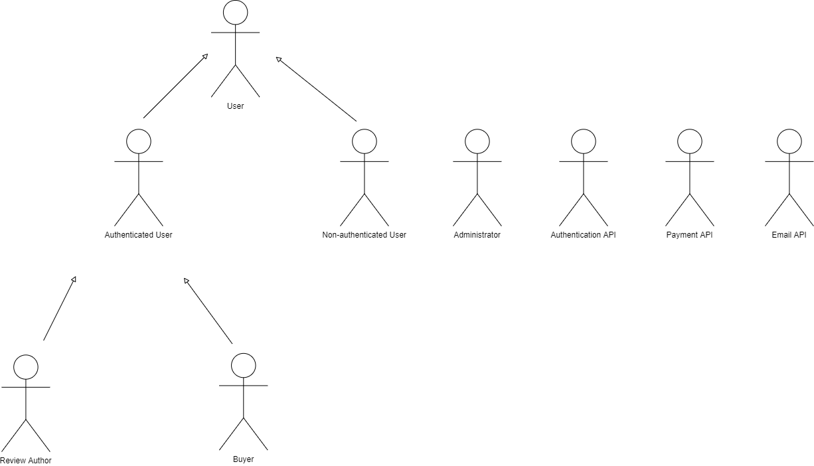
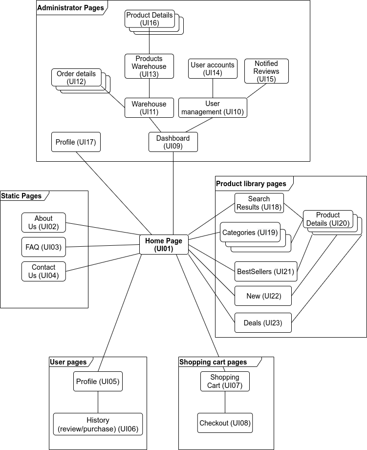
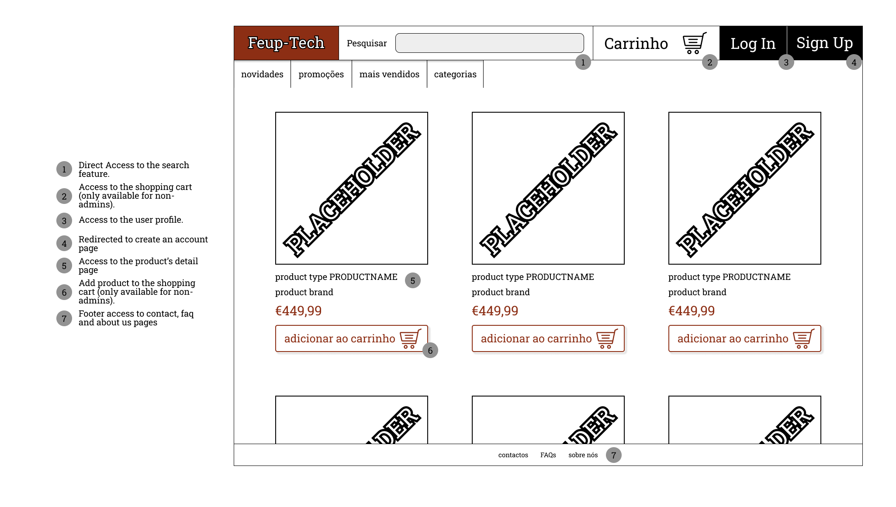
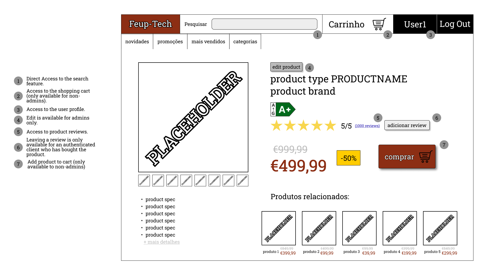

# ER: Requirements Specification Component

To help our community find the most suitable devices.

## A1: Project Name

The main goal of the Feup-Tech project is the development of an information system with a web interface to support an online technology store created for the use of members of the FEUP community.

Technology plays an integral part in our society, it helps us study, work and provides moments of relaxation, such as watching movies or playing games and to students, a personal computer is essential for college projects and assignments. Our main goal is to facilitate the access to these high-tech products, in a store platform that FEUP community members can use to buy the most suitable gadgets for their everyday work necessities, at a fair price.

The system keeps information about various products, including comments and ratings made by users, as well as, user accounts including payment methods, a wishlist and other features that make it easier for the buyers to use the online store. On top of that it also tracks user purchases, providing useful statistics to administrators.

There are two types of users in the system, the buyers and the administrators. The buyers can only make purchases if authenticated with a user account, otherwise they can only browse the existing products (with filters, attributes, exact match and full-text search) and create and use a shopping cart. Once authenticated, buyers can, not only, make purchases, but they also have access to a user profile from where they can manage payment methods, create and edit a wishlist, see their purchasing history and receive product recommendation. Once they buy a product, they can rate and review it as well as track or cancel any order made.

Administrators on the other hand are not buyers since they do not possess a shopping cart, payment methods or a wishlist. Instead, they can manage an order's status, moderate buyer reviews and accounts and add, remove or edit products and product specifications on top of being privy to buyers’ purchase history and sale statistics.

In conclusion, the platform aims to provide users with an easy to operate web interface, in which users can easily find the products they want and purchase what they need. Our focus will be in developing a design and page organization that reflects these principles.

## A2: Actors and User stories

This artifact contains the specification of the actors and their user stories, serving as agile documentation of the project’s requirements.

### 1. Actors

For the **FEUP-Tech** system, the actors are represented in Figure 1 and described in Table 1.

**Figure 1** - Feup-Tech Actors.

| **Identifier** | **Description** |
|------------------------------------|-------------------------------------|
| User | Generic user who has the power to browse and search for products as well as see the website’s static pages and add products to the shopping cart. |
| Non-Authenticated User | A user who can register themselves (sign-up) or sign-in. |
| Authenticated User | A user who has signed into the system and can make purchases (check out), manage and edit their profile from profile picture to payment methods and a wishlist, see personal notifications, receive product recommendations, and check their purchase history. |
| Buyer | A type of authenticated user who has purchased a product. A buyer can review the product and track or cancel an order. |
| Review Author | A type of authenticated user who has left a review on a product. A review author can edit and remove reviews. |
| Administrator | Someone who has signed into the system who has a role of moderating the overall content of the store. Their duties include supervising user profiles (blocking, removing), operating the products’ databases (reviews, quantities…), handling orders’ status and information and accessing sales statistics to coordinate supplies. |
| Payment API | External Payment API that can be used to make payments. |
| Email API | External Email API that can be used to send email notifications to users. |
| Authentication API | External Authentication API that can be used to register or authenticate into the system. |

<strong>Table 1</strong>- Feup-Tech actors’ description.

### 2. User Stories

For the **Feup-Tech** system, consider the user stories that are presented in the following sections.

#### 2.1 User

| **Identifier** | **Name** | **Priority** | **Description** |
|------------------------------------|------------------------------|----------------------------------|-------------------------------------|
| US001 | View Product List | high | As a _User_, I want to be able to view the products available in the store, so that I can know what I am able to purchase. \[FR101\] |
| US002 | Browse Product Categories | high | As a _User_ I want to be able to browse product categories, so that I can more easily find the type of products I am interested in. \[FR102\] |
| US003 | View Product Details | high | As a _User_, I want to be able to view product details, so that I know more about a product before deciding to purchase it. \[FR103\] |
| US004 | View Product Reviews | high | As a _User_, I want to be able to view product reviews, so that I can know what other people’s experience with the product was, before deciding to purchase it. \[FR104\] |
| US005 | Add Product to Shopping Car | high | As a _User_, I want to be able to add products to the shopping cart, so that I can have all the products I wish to buy in one easy to access place. \[FR105\] |
| US006 | Manage Shopping Cart | high | As a _User_, I want to be able to manage the shopping cart, so that I can remove any products I no longer want or change the amount of a certain product that I want. \[FR106\] |
| US007 | Search Products | high | As a _User_, I want to be able to search for products, so that I can easily find a specific product I want to purchase. \[FR107\] |
| US008 | See About Us page | high | As a _User_, I want to be able to go to the About Us page, to see more information about the company. \[FR061\] |
| US009 | See Contacts | high | As a _User_, I want to be able to go to the contacts page, to be able to contact the company for various reasons.  \[FR063\] |
| US010 | See FAQ | medium | As a _User_, I want to be able to go to the frequently asked questions, to be able to get the answer to a common question easily. |

<strong>Table 2</strong> - User user stories.

#### 2.2 Non-Authenticated User

| **Identifier** | **Name** | **Priority** | **Description** |
|------------------------------------|------------------------------|----------------------------------|-------------------------------------|
| US101 | Sign-in | high | As a _Non-Authenticated User_, I want to authenticate into the system, so that I can buy products and manage my profile. \[FR011\] |
| US102 | Sign-up | high | As a _Non-Authenticated User_, I want to register myself into the system, so that I can authenticate myself into the system.  \[FR012\] |
| US103 | Recover Password | high | As a _Non-Authenticated User_, I want to be able to access my account in case I lose my password.  \[FR013\] |

<strong>Table 3</strong> - Non-Authenticated User user stories.

#### 2.3 Authenticated User

| **Identifier** | **Name** | **Priority** | **Description** |
|------------------------------------|------------------------------|----------------------------------|-------------------------------------|
| US201 | View profile | high | As an _Authenticated User,_ I want to be able to view my public and private profile settings and information, so that I know what information I am currently making publicly available.  \[FR021\] |
| US202 | Manage profile | high | As an _Authenticated User,_ I want to manage all my account details (such as email, password, address, picture, preference settings, …) so that I can change them if they are no longer up to date.  \[FR022/23\] |
| US203 | Delete Account | high | As an _Authenticated user_, I want to delete all my account information, in accordance with the platform rules, because I no longer want to make purchases.  \[FR014\] |
| US204 | Log Out | high | As an _Authenticated User_, I want to be able to log out of my account, so that other people using the device can’t use it. |
| US205 | Go to checkout page | high | As an _Authenticated User_, I want to go to my checkout page, so that I can place an order. |
| US206 | Complete purchase/Checkout | high | As an _Authenticated User_, I want to complete my purchase so that my order can be shipped out. \[FR206\] |
| US207 | Leave a product rating and review | high | As an _Authenticated User_, I want to leave ratings and reviews, so that other people can make more thoughtfully planned purchases. \[FR205\] |
| US208 | Add product to the wishlist | high | As an _Authenticated User_, I want to add a product to my wishlist, so that I can save it for a future purchase. \[FR202\] |
| US209 | Manage wishlist | high | As an _Authenticated User_, I want to manage my wishlist so that I can remove products I no longer desire. \[FR203\] |
| US210 | See notifications panel | high | As an _Authenticated User_, I want to see all my notifications, so that I can check current orders’ information, account details and any platform changes (wishlist products, price changes…)  \[FR024\] |
| US211 | View Purchase History | high | As an _Authenticated User_, I want to see my purchase record, so that I can see past items I liked. \[FR201\] |
| US212 | See order information (before placing order) | medium | As an _Authenticated User_, I want to see my order details (delivery address, discounts applied, price…), so that I can review them. |
| US213 | Edit order information (before placing order) | medium | As an _Authenticated User_, I want to edit certain order specifications (addresses, quantities...), so that I can change invalid information. |
| US214 | Edit payment details | medium | As an _Authenticated User_, I want to edit my payment and billing details so that I can change them if they become invalid. |
| US215 | View the personal recommendations panel | medium | As an _Authenticated User_, I want to see the recommendation panel, so that I can be informed of products that might interest me. \[FR212\] |
| US216 | Manage Multiple Payment Methods | medium | As an _Authenticated User_, I want to manage my payment methods, so that I can have multiple options on checkout. \[FR204\] |
| US217 | Report Review | medium | As an _Authenticated User_, I want to report any review that (according to my perspective) violates the store rules and agreements, to be further evaluated by an administrator. \[FR207\] |
| US218 | Manage Account Credits | low | As an _Authenticated User_, I want to manage account credits, so that I can add credits to use in the future. \[FR211\] |
| US219 | Appeal for unblock | low | As an _Authenticated User_, I want to appeal for unblock, so that I can continue to write reviews. \[FR025\] |

<strong>Table 4</strong> - Authenticated User user stories.

#### 2.4 Buyer

| **Identifier** | **Name** | **Priority** | **Description** |
|------------------------------------|------------------------------|----------------------------------|-------------------------------------|
| US301 | Review Purchased Product | high | As a _Buyer_ I want to review a purchased product so that other users can make a more well-informed decision while buying. \[FR205/301\] |
| US302 | Track Order | high | As a _Buyer_ I want to track my orders in order to know when my product will arrive and where it is at the current moment. \[FR402\] |
| US303   | Cancel Order | high | As a _Buyer_ I want to be able to cancel an order in case I regret making it or made it by accident. \[FR403\] |
| US304 | Edit Order | low | As a _Buyer_ I want to be able to, for a limited time, edit an order’s details in case I input wrong mailing or billing information (delivery information can be altered, depending on order status). |

<strong>Table 5</strong> - Buyer user stories.

#### 2.5 Review Author

| **Identifier** | **Name** | **Priority** | **Description** |
|------------------------------------|------------------------------|----------------------------------|-------------------------------------|
| US401 | Edit Review | high | As a _Review Author_ I want to edit my previous reviews so that I can fix spelling/ grammatical errors and change the provided information if it’s not up to date. \[FR301\] |
| US402 | Delete Review | high | As a _Review Author_ I want to delete my previous reviews in case they do not stand anymore or if I don’t want other people seeing said reviews. \[FR302\] |

<strong>Table 6</strong> - Review Author user stories.

#### 2.6 Administrator

| **Identifier** | **Name** | **Priority** | **Description** |
|------------------------------------|------------------------------|----------------------------------|-------------------------------------|
| US501 | Add Product | high | As an _Administrator_ I want to add a product to the website so that it is available for users to buy it. \[FR601\] |
| US502 | Manage Products’ Information | high | As an _Administrator_ I want to manage products’ information so that I can keep it updated.  \[FR602/605\] |
| US503 | Manage Products’ Stock | high | As an _Administrator_ I want to manage products’ stock in order to keep it updated.  \[FR603\] |
| US504 | Manage Product Categories | high | As an _Administrator_ I want to manage product categories so that I can add or remove categories of products.  \[FR604\] |
| US505 | View Users’ Purchase History | high | As an _Administrator_ I want to view the users’ purchase history so that I can improve the experience I offer them.  \[FR606\] |
| US506 | Manage Order Status | high | As an Administrator I want to manage the orders’ status so that users may know the situation of their purchase.  \[FR607\] |
| US507 | Administer User Accounts | high | As an _Administrator_ I want to administer users’ accounts so that I can make sure no one is violating the community guidelines. \[FR041/042/608\] |
| US508 | Block and Unblock User Accounts | high | As an _Administrator_ I want to block and unblock users’ accounts from making revies in order to enforce community guidelines. \[FR043\] |
| US509 | Delete User Account | high | As an _Administrator_ I want to delete users’ accounts in order to eliminate bot and spam accounts.  \[FR044\] |

<strong>Table 7</strong> - Administrator user stories.

### 3. Supplementary Requirements

This section contains business rules, technical requirements and other non-functional requirements on the project.

#### 3.1 Business rules

| **Identifier** | **Name** | **Description** |
|------------------------------------|------------------------------|-------------------------------------|
| BR01 | Account deletion | Upon account deletion, shared user data (e.g. comments, reviews, likes) is kept but is made anonymous. \[BR011\] |
| BR02 | Administrators accounts independency | Administrators can’t access user’s features that relate to purchases (checkout, manage their own shopping lists...). |
| BR03 | Cancelling and refunds | Order cancellation and refunds are available until shipment.  |
| BR04 | Changing order information (after the order is placed) | An order’s billing method can be altered until payment and an order’s address can be edited until the order is shipped out. |
| BR05 | Available stock | To complete a purchase, the product in question must have available stock. |
| BR06 | Unique review | An authorized user can only make one review/rating per product. |
| BR07 | Review rating | A review must have a mandatory rating. |

<strong>Table 8</strong>- Feup-Tech business rules.

#### 3.2. Technical requirements

| **Identifier** | **Name** | **Description** |
|------------------------------------|------------------------------|-------------------------------------|
| TR01 | Performance | The system should have response times shorter than 2s to ensure the user's attention |
| **TR02** | **Robustness** | **The system must be prepared to handle and continue operating when runtime errors occur.**   **It’s important that Feup-Tech can continue functioning as expected after encountering a runtime error to avoid unnecessary confusion and enhance the user experience.** |
| TR03 | Scalability | The system must be prepared to deal with the growth in the number of users and their actions. |
| **TR04** | **Accessibility** | **The system must ensure that everyone can access the pages, regardless of whether they have any handicap or not, or the Web browser they use.**   **In order to cater to users who have any type of handicap, our platform must ensure the design model is clear and that the necessary measures are taken to implement accessibility features (e.g. facilitate screen reading protocols) that help these customers browse the store.** |
| TR05 | Availability | The system must be available 99 percent of the time in each 24-hour period |
| **TR06** | **Usability** | **The system should be simple and easy to use.**   **The FeupTech system is designed in a way that ensures that any user in any context can use it intuitively, regardless of their age or technical experience.** |
| TR07 | Web Application | The system should be implemented as a web application with dynamic pages (HTML5, JavaScript, CSS3 and PHP). |
| TR08 | Portability | The server-side system should work across multiple platforms (Linux, Mac OS, etc.). |
| TR09 | Database | The PostgreSQL database management system must be used, with a version of 11 or higher. |
| TR10 | Security | The system shall protect information from unauthorized access with an authentication and verification system. |
| TR11 | Ethics | The system must respect the ethical principles in software development (for example, personal user details, or usage data, should not be collected nor shared without full acknowledgement and authorization from its owner) |

<strong>Table 9</strong>- Feup-Tech technical requirements.

#### 3.3. Restrictions

| **Identifier** | **Name** | **Description** |
|------------------------------------|------------------------------|-------------------------------------|
| C01 | Deadline | The system should be ready by the 17th of January so that sales can start at the beginning of the second semester. |

<strong>Table 10</strong>- Feup-Tech project restrictions.

## A3: Information Architecture

This artefact presents a brief overview of the information architecture of the system to be developed and includes two elements, a sitemap, defining how the information is organized in pages and a set of wireframes, defining the functionality and the content for two important pages.

### 1. Sitemap

This sitemap represents the overall scheme of the **Feup-Tech** platform. It is divided in 5 main sections:

●       Homepage,

●       Static Pages (provide general information about the store),

●       User pages (details available to an authenticated user),

●       Shopping cart pages (access to order and checkout stages),

●       Product Library pages (connect to the products’ database),

●       Administrator pages (dashboard with privileged actions for product and user management).

 

**Figure 2 -** Feup-Tech sitemap.

### 2. Wireframes

The wireframes presented below describe the layout of the **Homepage** (UI01) and the **Product details page** (UI20), combining the view of both the Administrator and a non-authenticated user.

#### UI01: Homepage

**Figure 3 -** Homepage (UI01) wireframe.

#### UI20: Product Details Page

**Figure 4 -** Product Details (UI20) wireframe.

---

### Revision history

---

GROUP2124, 08/11/2021

* António Ribeiro [up201906761@edu.fe.up.pt](mailto:up201906761@edu.fe.up.pt)
* Diogo Pereira [up201906422@edu.fe.up.pt](mailto:up201906422@edu.fe.up.pt)
* Joana Mesquita [up201907878@edu.fe.up.pt](mailto:up201907878@edu.fe.up.pt)
* Margarida Ferreira [up201905046@edu.fe.up.pt](mailto:up201905046@edu.fe.up.pt)

---

Editor:

* Joana Mesquita [up201907878@edu.fe.up.pt](mailto:up201907878@edu.fe.up.pt)