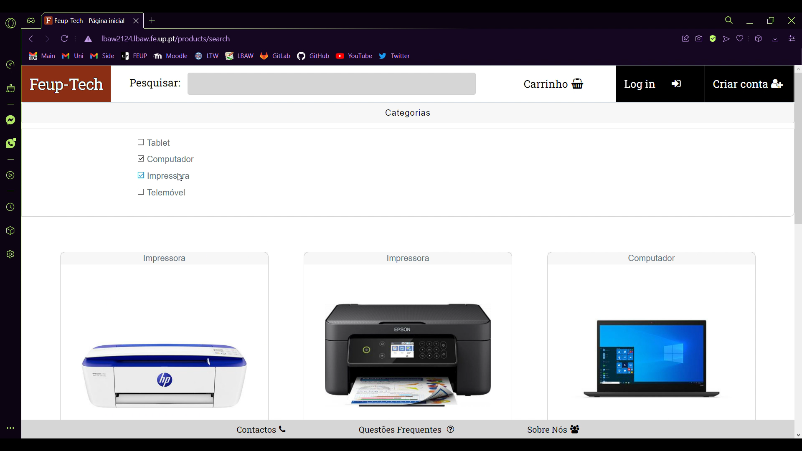
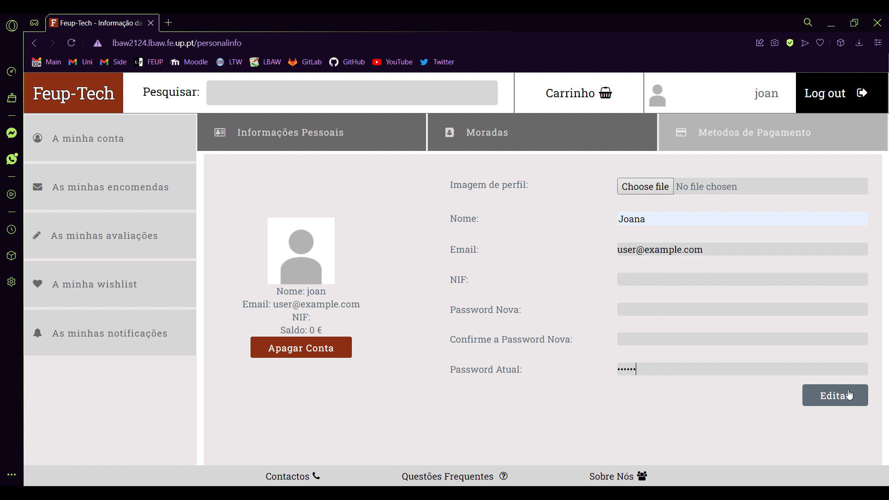
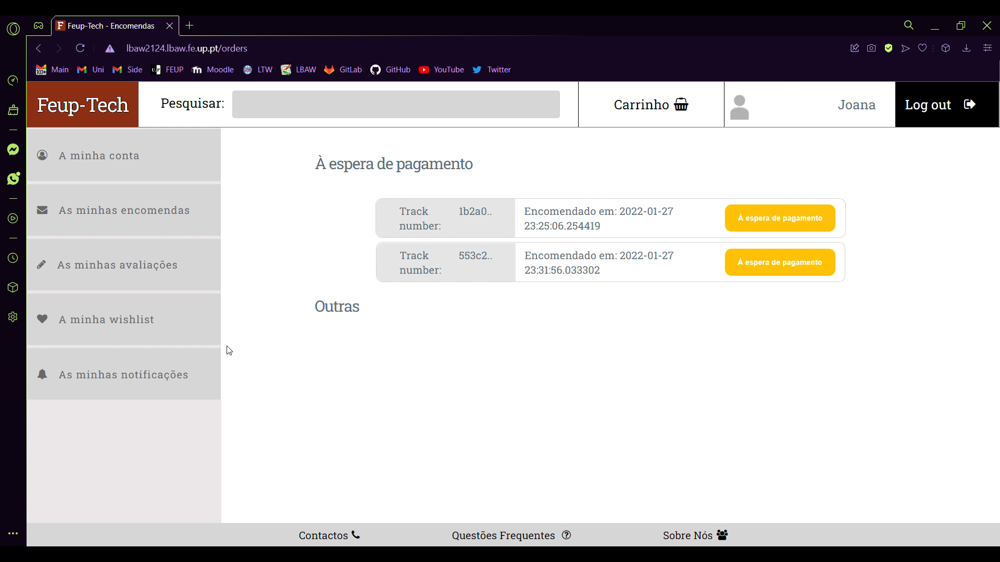
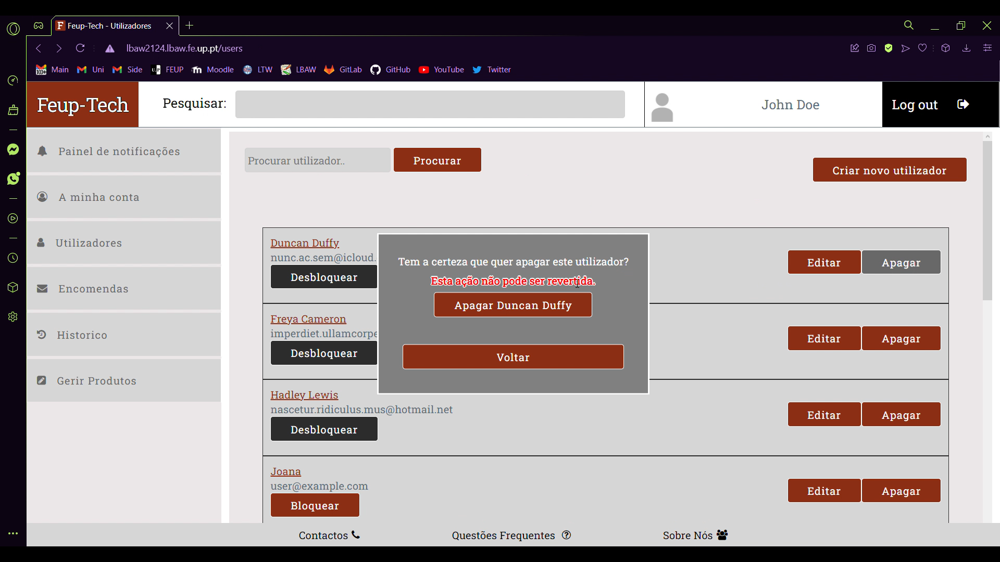

# PA: Product and Presentation
## A9: Product

- The website we developed is called Feup-Tech and it is an online store platform for tech related products. In it you can find all the traits of a shopping website, the cart, wishlists, checkout operation, tracking orders, user dashboard, product reviews etc. 
- Our goal was to provide not only a vast amount of features to possible customers, but also to provide feedback and operation control to the adminstrators, who manage all the store's information/logic and need realiable ways of interacting with the clients. 


<br>


### 1. Installation

Final version of the source code: https://git.fe.up.pt/lbaw/lbaw2122/lbaw2124

#### To make sure all dependencies are installed:

> composer install

> php artisan clear-compiled

> php artisan optimize

#### To start the website localy:

 - make sure .env configs match the following

```
DB_CONNECTION=pgsql
DB_HOST=localhost
DB_PORT=5432
DB_SCHEMA=lbaw2124
DB_DATABASE=lbaw2124
DB_USERNAME=postgres
DB_PASSWORD=pg!password
```
- run the following commands:
> docker-compose up - start the docker container with postgres 

> php artisan db:seed - populate the database with the included sql file 

> php artisan serve - serve the website into the configurated host

#### To start the website from the production server:

- make sure .env configs match the following:

```
DB_CONNECTION=pgsql
DB_HOST=https://git.fe.up.pt/lbaw/lbaw2122/lbaw2124
DB_PORT=5432
DB_SCHEMA=lbaw2124
DB_DATABASE=lbaw2124
DB_USERNAME=lbaw2124
DB_PASSWORD=ORhzmEgI
```
- run the following commands:
> docker build -t git.fe.up.pt:5050/lbaw/lbaw2122/lbaw2124

> docker push git.fe.up.pt:5050/lbaw/lbaw2122/lbaw2124

<br>

### 2. Usage

URL to the product: http://lbaw2124.lbaw.fe.up.pt

#### 2.1. Administration Credentials

| Username | Password|
|-|-|
|ipsum@hotmail.edu|KCN92EMV1HG|

#### 2.2. User Credentials

|Type| Username | Password|
|-|-|-|
|Normal User|imperdiet.ullamcorper@protonmail.couk|VSO36ISH4DT|

<br>

### 3. Application Help

- Forms have error messages, that appear in case the user enters invalid information (login inputs).
- If the user is prohibited of making some action, a reason is presented (remove used category in the admin dashboard, heading to checkout with a product not in stock).
- Success and Error messages notifications are displayed whenever the user performs an action which is correctly/incorrectly answered by the server. 

<br>

### 4. Input Validation

- During account creation, passwords that do not contain at least 6 characters are not accepted.
- Emails are validated with a regex and NIFs are evaluated in the client side to check if a number only format is provided and later as a database trigger if the number actually matches the standard's compliance (see _alert_wrong_nif_ trigger) . 

<br>

### 5. Check Accessibility and Usability

We preformed accessibility and usability test of which the results can be found in the following:

- Usability checklist - https://git.fe.up.pt/lbaw/lbaw2122/lbaw2124/-/blob/main/A9_A10_files/Checklist%20de%20Usabilidade%20-%20SAPO%20UX.pdf
- Accessibility checklist - https://git.fe.up.pt/lbaw/lbaw2122/lbaw2124/-/blob/main/A9_A10_files/Checklist%20de%20Acessibilidade%20-%20SAPO%20UX.pdf


<br>

### 6. HTML & CSS Validation

We preformed a validation of the HTML and CSS present in our code with the following results:

- HTML:
    - Homepage - https://git.fe.up.pt/lbaw/lbaw2122/lbaw2124/-/blob/main/A9_A10_files/homepage_html_check.pdf
    - Product Details - https://git.fe.up.pt/lbaw/lbaw2122/lbaw2124/-/blob/main/A9_A10_files/product_details_html_check.pdf
- CSS: https://git.fe.up.pt/lbaw/lbaw2122/lbaw2124/-/blob/main/A9_A10_files/css_check.pdf

<br>

### 7. Revisions to the Project

- Many revisions were made to the database:
    - Language changed to portuguese in messages and text contents. 
    - All images previously mantained as a BYTEA were changed to TEXT attributes that indicate the file name. 
    - Changed all RAISE NOTICES in triggers and transactions to RAISE EXEPTIONS so they could be handle by the php;
    - Triggers:
        - A trigger was added to avoid admins and users having the same email causing login problems;
        - A trigger which blocked a user from making reviews automatically after three review was removed;
    - Tables: 
        - users: attributes blocked and remember_token were added.
        - admins: attribute profile_pic was added and table name changed from administrator for laravel use. 
        - product: id_product was updated to an hash value in TEXT format, on_sale was converted to BOOLEAN. 
        - reviews: attribute hidden was added. 
        - orders: track_number was updated to an hash value in TEXT format.
        - __NEW__ admin_dashboard table was added to facilitate the access to admin notifications and their meaning.
            - dashboard_review and dashboard_user were added as derivate tables from admin_dashboard. 
        - __NEW__ admin_history table was added in order to store the admin's action history, with the following derivate tables:
            - modification (modifyed)
            - hidden_review 
            - blocked 
            - deleted (modifyed)
            - order_update
        - __NEW__ password_resets table was added. It's responsible for the storage of password recuperation attempts, accompanied by the respective validation token, the user information and the current timestamp, that allows the implementation of a lease/acceptance timeout. 
    - Transactions:
        - All transactions responsible for admin actions now create an entry in the admin_history table;
        - The transaction product_on_sale was changed to create the discounts in a different manner;
        - remove_category_transaction was created to allow admins to remove transactions;
        - delete was added to give all reviews of a deleted user to the user of id=0 which represents a deleted user;
        - block and unblock were added to allow the administrators to block and unblock users;
        - hide_review and show_review were added to allow the administrators to hide and show reviews;
        - report_review was added to allow users to report eachother. 
    - Indexes: 
        - product's category index is now interpreted as an hash.
        - reviews' index is clustered. 
        - notifications' index is hash based. 
        - orders' table index is btree based and clustered.
        - order status' index is hash based. 
        
<br>

### 8. Implementation Details


#### 8.1. Libraries Used
|Name|Link|Usage|Example|
|-|-|-|-|
|Bootstrap |https://getbootstrap.com| For some css| In the cards for the products (http://lbaw2124.lbaw.fe.up.pt/products/4)|
|Font Awesome|https://fontawesome.com| Used to add some illustrative icons. | In the top navegation bar both in desktop and mobile mode (http://lbaw2124.lbaw.fe.up.pt/products), in the user and admin menus (must log in) (http://lbaw2124.lbaw.fe.up.pt/personalinfo and http://lbaw2124.lbaw.fe.up.pt/admin) and in product details for ratings (http://lbaw2124.lbaw.fe.up.pt/products/4) |

#### 8.2 User Stories
| **US Identifier** | **Name** | **Module** | **Priority** | **Team Members** | **State** |
|-|-|-|-|-|-|
| US001 | View Product List                             | Module 03 | high      | **António Ribeiro**    |100%  |
| US002 | Browse Product Categories                     | Module 03 | high      | **Diogo Pereira**      |100%  |
| US003 | View Product Details                          | Module 03 | high      | **António Ribeiro**    |100%  |
| US004 | View Product Reviews                          | Module 02 | high      | **Margarida Ferreira** |100%  |
| US005 | Add Product to Shopping Car                   | Module 04 | high      | **António Ribeiro**    |100%  |
| US006 | Manage Shopping Cart                          | Module 04 | high      | **António Ribeiro**    |100%  |
| US007 | Search Products                               | Module 03 | high      | **Diogo Pereira**      |80%   |
| US008 | See About Us page                             | Module 07 | high      | **Diogo Pereira**      |100%  |
| US009 | See Contacts                                  | Module 07 | high      | **Diogo Pereira**      |100%  |
| US010 | See FAQ                                       | Module 07 | medium    | **Diogo Pereira**      |100%  |
| US101 | Sign-in                                       | Module 01 | high      | **Joana Mesquita**     |100%  |
| US102 | Sign-up                                       | Module 01 | high      | **Joana Mesquita**     |100%  |
| US103 | Recover Password                              | Module 01 | high      | **Joana Mesquita**     |100%  |
| US201 | View profile                                  | Module 01 | high      | **Joana Mesquita**     |100%  |
| US202 | Manage profile                                | Module 01 | high      | **Joana Mesquita**     |100%  |
| US203 | Delete Account                                | Module 01 | high      | **Diogo Pereira**      |90%   |
| US204 | Log Out                                       | Module 01 | high      | **Joana Mesquita**     |100%  |
| US205 | Go to checkout page                           | Module 04 | high      | **Margarida Ferreira** |100%  |
| US206 | Complete purchase/Checkout                    | Module 05 | high      | **Margarida Ferreira** |100%  |
| US207 | Leave a product rating and review             | Module 02 | high      | **António Ribeiro**    |100%  |
| US208 | Add product to the wishlist                   | Module 02 | high      | **António Ribeiro**    |100%  |
| US209 | Manage wishlist                               | Module 02 | high      | **António Ribeiro**    |100%  |
| US210 | See notifications panel                       | Module 01 | high      | **Margarida Ferreira** |100%  |
| US211 | View Purchase History                         | Module 01 | high      | **António Ribeiro**    |100%  |
| US212 | See order information (before placing order)  | Module 05 | medium    |           -            | 0%   |
| US213 | Edit order information (before placing order) | Module 05 | medium    | **Diogo Pereira**      |100%  |
| US214 | Edit payment details                          | Module 01 | medium    |           -            | 0%   |
| US215 | View the personal recommendations panel       | Module 01 | medium    |           -            | 0%   |
| US216 | Manage Multiple Payment Methods               | Module 01 | medium    |           -            | 0%   |
| US217 | Report Review                                 | Module 02 | medium    | **Joana Mesquita**     |50%   |
| US218 | Manage Account Credits                        | Module 01 | low       |           -            | 0%   |
| US219 | Appeal for unblock                            | Module 01 | low       | **Joana Mesquita**     |100%  |
| US301 | Review Purchased Product                      | Module 02 | high      | **Diogo Pereira**      |100%  |
| US302 | Track Order                                   | Module 05 | high      |           -            |  0%  |
| US303 | Cancel Order                                  | Module 05 | high      | **Diogo Pereira**      |100%  |
| US304 | Edit Order                                    | Module 05 | low       |           -            | 0%   |
| US401 | Edit Review                                   | Module 02 | high      | **António Ribeiro**    |100%  |
| US402 | Delete Review                                 | Module 02 | high      | **António Ribeiro**    |100%  |
| US501 | Add Product                                   | Module 03 | high      | **Margarida Ferreira** |100%  |
| US502 | Manage Products’ Information                  | Module 03 | high      | **Margarida Ferreira** |100%  |
| US503 | Manage Products’ Stock                        | Module 03 | high      | **Margarida Ferreira** |100%  |
| US504 | Manage Product Categories                     | Module 03 | high      | **Margarida Ferreira** |100%  |
| US505 | View Users’ Purchase History                  | Module 06 | high      | **Joana Mesquita**     |100%  |
| US506 | Manage Order Status                           | Module 05 | high      | **Joana Mesquita**     |100%  |
| US507 | Administer User Accounts                      | Module 06 | high      | **Margarida Ferreira** |100%  |
| US508 | Block and Unblock User Accounts               | Module 06 | high      | **Margarida Ferreira** |100%  |
| US509 | Delete User Account                           | Module 06 | high      | **Joana Mesquita**     |90%   |
<br>

## A10: Presentation

This artefact corresponds to the presentation of the product.
<br>

### 1. Product presentation

- Feup-Tech is a tech oriented e-commerce platform, in which a client can browse and purchase a vast amount of smartphones, printers, laptops and many other categories of products. Our aim is to provide an intuitive and accessible website, that includes a lot of features that any user can take advantage of. 
- Users can browse through the different categories and products' pages, while adding products to their shopping cart. Once logged in, they have access to a broad set of features. A wishlist, the ability to make reviews, checkout their order and view their personalized dashboard, where they can see event notifications, track their orders and activity, change account information or delete their account. 
- On the management side, administrators have an unique dashboard, that acts as a central console, granting them control of the whole store. There, they can manage users (block, delete them), add new products and categories, update stock and change orders' status, besides of seeing their notification pannel that alerts them for relevant in store behaviour.

>  http://lbaw2124.lbaw.fe.up.pt

<br>

### 2. Video presentation

Video: https://drive.google.com/file/d/1X43-mQZoH82-JS7wsmQ2o1198BeXsokI/view?usp=sharing

Video Screenshots:

- Home page



- User dashboard 



- Order info 



- Delete user 



<br>

---

## Revision history

GROUP2124, 02/01/2021

* António Ribeiro [up201906761@edu.fe.up.pt](mailto:up201906761@edu.fe.up.pt)
* Diogo Pereira [up201906422@edu.fe.up.pt](mailto:up201906422@edu.fe.up.pt)
* Joana Mesquita [up201907878@edu.fe.up.pt](mailto:up201907878@edu.fe.up.pt)
* Margarida Ferreira [up201905046@edu.fe.up.pt](mailto:up201905046@edu.fe.up.pt)

---

Editor:

* Diogo Pereira [up201906422@edu.fe.up.pt](mailto:up201906422@edu.fe.up.pt)